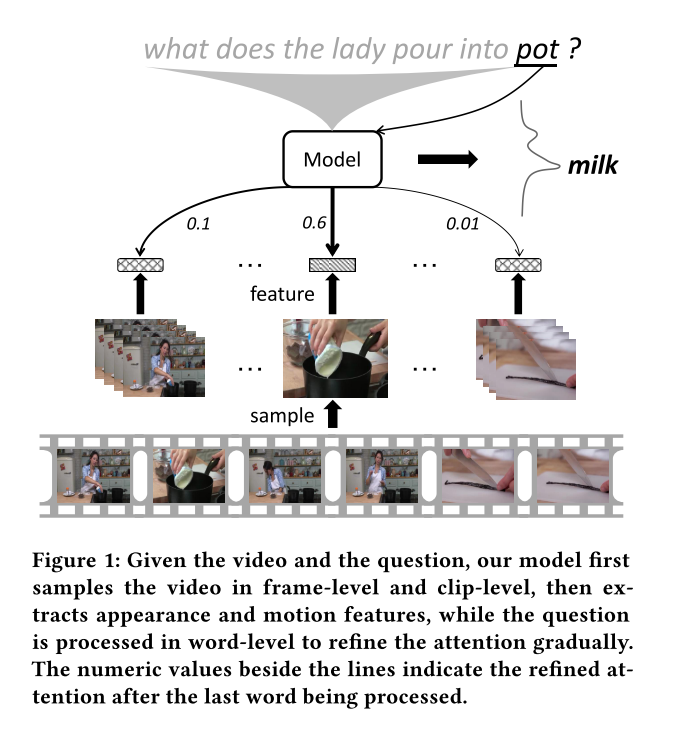
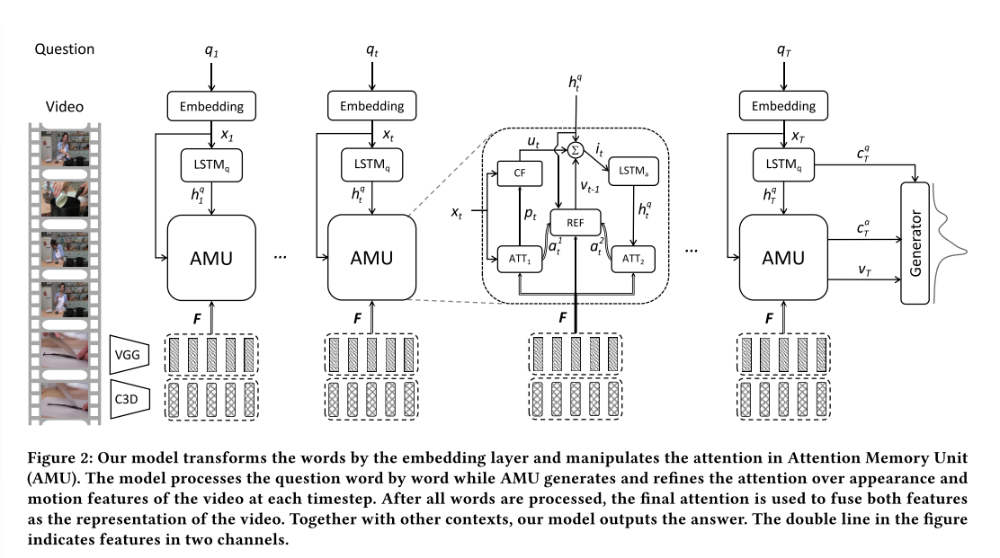
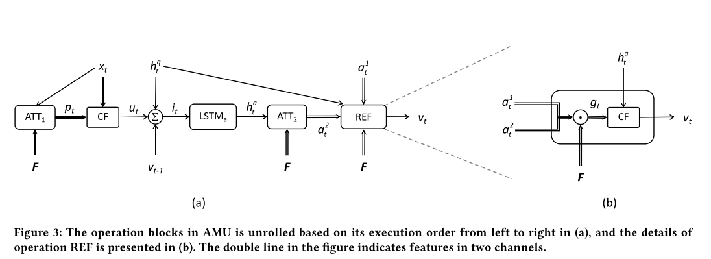
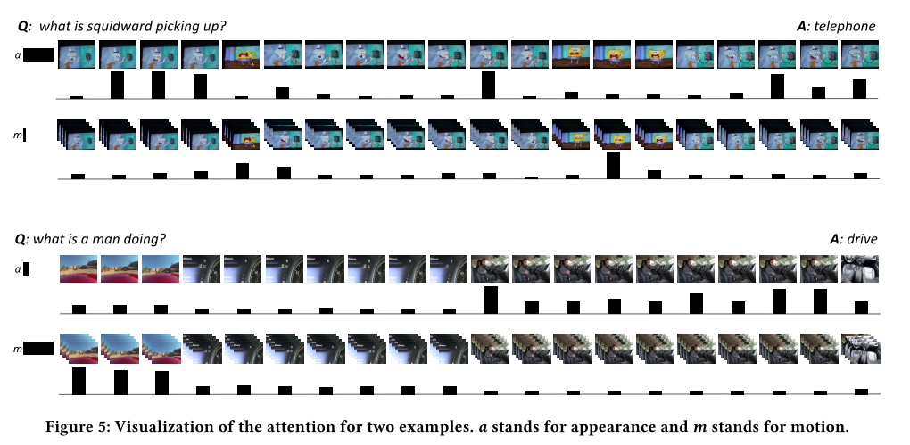

##### Video Question Answering via Gradually Refined Attention over Appearance and Motion

在VideoQA中，问题可能涉及到视频的不同细节，答案不可能统一。为了得到答案，模型需要仔细的分析问题和关注视频的部分重要信息。

本文中，我们提出了一个端到端的视频问答模型。模型首先采样出视频一系列的帧和片段，从中抽取出纹理和运动特征。随后，模型逐词的读取问题并且利用帧级和片段级相互作用的特征来精炼模型的注意力。当所有问题的单词被处理时，模型产生最终最优的注意力，该注意力融合了纹理和运动特征做为视频的表征。在整个过程中，粗糙的问题特征和精细的单词特征都被利用。

本文的主要贡献如下：

我们提出利用基于视频的外观和运动信息来解决VideoQA任务。

我们使用粗糙的问题特征结合精细的单词特征做为引导提出精炼视频注意力的模型。

我们利用两个数据集来评估我们提出的模型。

方法

给出视频V和问题Q,VideoQA的目标是给出恰当的回答A。对于一个给定的视频，第一步先从视频中提取出外观和运动信息，随后逐词的分析问题并且在每个时步通过AMU精炼针对这些特征的注意力。问题的最后一个词被处理后，模型产生与视频最相关、最有价值的精炼注意力来回答特定问题。模型使用这个注意力来融合外观和运动特征，得到视频的表征。为了产生回答，其他如问题信息和注意力历史上下文信息也被用做推断。

##### Feature Extraction

Apperarance:我们的模型，采用VGG network 作为帧级外观特征的提取器。对于给定的视频，我们将它的外观特征表示为$F_a = [f^a_1,f^a_2,...,f^a_N]$，$N$是视频中采样的帧数，$a$表明外观。

Motion:C3D network有捕获视频动态信息的能力，所以我们使用C3D network作为片段级运动特征的提取器。对于给定的视频，通过C3D network采样的片段被处理，采集出来的运动信息表示为$F_m = [f^m_1,f^m_2,...,f^m_N]$，$N$是视频采样的片段数，$m$表明运动。 

Question:问题表示为一系列的词汇标注$Q = [q_1,q_2,...,q_T]$，我们使用embedding layer将$q_t$转化成embedding $x_t$。

##### AMU

问题的单词按顺序被处理，同时一个新颖的注意力机制在过程中被应用。模型首先使用embedding layer 将输入单词转化成embedding $x_t$，这保存当前单词的语义信息。embedding $x_t$随后喂入LSTM~q~，这一步操作可认为是将处理过的问题信息保存下来。将$x_t$和$h^q_t$输入到AMU单元，针对外观和运动特征产生并精炼注意力。如图2所示，AMU将当前的word embedding，question information，and video features作为输入，随后对视频特征执行几轮精炼注意力。为了清楚起见，我们使用双线表示包含2个通道的特征。

AMU中包含4种操作

为了清楚起见，我们按照执行顺序，展开AMU的操作模块。

ATT~1~ :基于$x_t$对$F$执行初始化注意力并关注与当前单词的相关的视频特征。（即与当前词越相关的信息越容易保留下来）

CF:将外观特征$p^a_t$和运动特征$p^m_t$通过CF加权求和，CF给每个通道权重分数并得到中间变量融合表征$u_t$。

LSTM~a~:$h^q_t$、之前产生的视频表征$v_{t-1}$和$u_t$相加做为LSTM~a~的输入，LSTM~a~保存了所有执行过的注意力操作。(包含了上一时步的信息)

ATT~2~:基于$F$，ATT~2~使用$h^a_t$执行第二次注意力机制。

REF:第一次注意力权重$a^1_t$和第二次注意力权重$a^2_t$在REF被精炼，并且产生视频表征$v_t$。

##### Attention

给定一个关于视频的问题，帧或者片段只有一个小的集合里，大多数时间是相关的。这些特征对于给出答案是有用的。注意力机制旨在分别给视频的外观和运动特征分配权重同时结合它们的权重得到有用的特征。AMU中有两个注意力操作ATT~1~和ATT~2~。以ATT~1~为例，ATT~1~利用$x_t$对视频特征$F$执行注意力机制。为了简单起见，我们省略了外观和运动的标注。每个特征通道，该操作都被执行。注意力机制公式表述如下：
$$
e_i = tanh(W_ff_i + b_f)^Ttanh(W_xx_t + b_x)
$$

$$
a_i = \frac{exp(e_i)}{\quad\sum_{i=1}^{N}exp(e_i)}
$$

权重$a_i$反应的是当前词与第$i$个特征的相关程度，$W_f$和$W_x$用来将word embeddings 和 video features转化到相同的潜在embeding space。通过$a_i$，计算融合特征$p_t$，公式如下：
$$
p_t = \quad\sum_{i=1}^{N}a_itanh(W_ff_i + b_f)
$$
$p_t$是此问题下当前单词的视频表征。当回答这问题时，$p_t$是ATT~1~给予当前单词的影响力。之后ATT~2~将使用$h^a_t$执行另外一个注意力操作并产生第二个注意力权重。

##### Channel Fusion

在得到$p_t$之后，实际上是由$p^a_t$和$p^m_t$组成，这两个特征融合形成中间视频表征$u_t$。因为问题中的单词可能和外观和运动的关联有不同的强度，模型使用当前的单词给每个通道特征分配权重并融合：
$$
s^a_t,s^m_t = softmax(W_mx_t + b_m)
$$

$$
u_t = s^a_tp^a_t + s^m_tp^m_t
$$

计算得到的关联强度分别为$s^a_t$,$s^m_t$，融合的表征$u_t$吸收了基于当前单词的视频外观和运动通道的信息。

##### Memory

我们使用LSTM~a~去控制第二次注意力操作的输入并保存注意力历史。$h^q_t$、之前产生的视频表征$v_{t-1}$和$u_t$求和做为LSTM~a~的输入，产生的$h^a_t$用来作为ATT~2~的输入。

##### Refine

在执行完ATT~2~后，模型产生了基于$F$的第二个注意力权重$a^2_t$。两次注意力权重用来精炼注意力。公式如下：
$$
a_t = (a^1_t + a^2_t)/2
$$
$$
g_t = \quad\sum_{i=1}^{N}a^i_ttanh(W_ff_i + b_f)
$$

$$
v_t = CF(h^q_t,g_t)
$$

$g_t$实际上包括来自外观和运动的$g^a_t$和$g^m_t$，$v_t$是时步$t$的最终视频融合表征。

上述注意力机制过程中，模型使用了精确的词汇信息和粗糙的问题信息来逐步精炼视频外观和运动特征的注意力。当前词嵌入的注意力能够提升藏在问题向量特征中的关键词信息，当融合这些特征时，问题信息可以给出更加通用的指导。在AMU处理完所有问题的词汇时，回答问题最相关的、最显著的精炼视频表征随之产生。

##### Answer Generation

在时步$T$，问题的最后一个词被处理之后，我么得到视频融合表征$v_T$。我们有另外两个上下文信息。问题LSTM~q~得到的包含问题信息的记忆向量$c^q_T$和AMU得到的包含注意力过程的记忆向量$c^a_T$。

我们能够准备好预先定义好的回答集，并产生一个简单的softmax分类器。回答公式如下：
$$
answer = arg\ max\ softmax(W_g(W_xc^q_T.c^a_T.v_T))
$$
回答也能够通过LSTM network产生。问题信息$c^q_T$和注意力过程$c^a_T$被用来初始化LSTM network，同时精炼视频表征$v_T$用来作为它的第一个输入。回答的每个词可以像上述公式一样产生。

