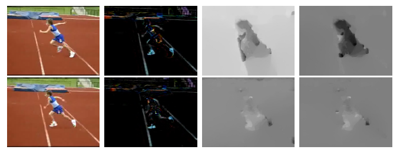

# TSN model

TSN基于two-stream方法构建

主要贡献：

- 提出了TSN(Temporal Segment Networks)模型，基于长范围时间结构(long-range temporal structure)建模，结合稀疏时间采样策略(sparse temporal sampling strategy)和视频级监督(video-level supervision)来保证使用整段视频时学习的有效和高效。
- 在TSN的帮助下，研究了一系列关于视频数据学习卷积网络的良好实践

数据集表现：HMDB51(69.4%)、UCF(94.2%)

### TSN行为识别

two-stream卷积网络对于长范围时间结构的建模无能为力，主要因为它仅仅操作一帧(空间网络)或者操作短片段中的单堆帧(时间网络)，因此对时间上下文的访问时有限的。视频级框架TSN可以从整段视频中建模动作。

和two-stream一样，TSN也是由空间流卷积网络和时间流卷积网络构成。但不同于two-stream采用单帧或者单堆帧，TSN使用从整个视频中稀疏地采样一系列短片段，每个片段都将给出其本身对于行为类别的初步预测，从这些片段的“共识”来得到视频级的预测结果。在学习过程中，通过迭代更新模型参数来优化视频级预测的损失值。

TSN网络示意图：

​                                                              
**图1 TSN网络示意图**

由上图所示，一个输入视频分为***K***段(segment)，一个片段(snippet)从它对应的段中随机采样得到。不同片段的类别得分采用段共识函数(The segmental consensus function)进行融合来产生段共识(segmental consensus)，这是一个视频级的预测。然后对所有模式的预测融合产生最终的预测结果。

具体来说，给定一段视频***V***，把它按相等间隔分为***K***段{*S1*,*S2*,...,*Sk*}。接着，TSN按如下方式对一系列片段进行建模：
$$
TSN(T_1,T_2,···,T_k)=H(G(F(T_1;W),F(T_2;W),F(T_2;W),···,F(T_K;W)))
$$
其中：

- (T1,T2,...,Tk)代表片段序列，每个片段Tk从它对应的段Sk中随机采样得到。
- F(Tk;W)函数代表采用W作为参数的卷积网络作用于短片段Tk，函数返回Tk相对于所有类别的得分。
- 段共识函数G(The segmental consensus function)结合多个短片段的类别得分输出以获得他们之间关于类别假设的共识。
- 基于这个共识，预测函数H预测整段视频属于每个行为类别的概率(本文H选择了softmax函数)。

结合标准分类交叉熵损失(cross-entropy loss)，关于部分共识的最终损失函数G的形式为：
$$
L(y,G)=-\sum_{i=1}^{C}y_i(G_i - log\sum_{j=1}^{C}exp G_j)
$$
其中，C是行为总类别数，yi是类别i的groundtruth，实验中片段的数量K设置为3。共识函数的形式是一个开放的问题，本工作中共识函数G采用最简单的形式，即Gi = g(Fi(T1),...,Fi(Tk))，采用聚合函数g(aggregation function)从所有片段中相同类别的得分中推断出某个类别分数Gi。聚合函数g采用平均法来表示最终识别精度。

TSN是可微的，或者至少有次梯度，由g函数的选择决定。这使我们可以用标准反向传播算法，利用多个片段来联合优化模型参数W。在反向传播过程中，模型参数W关于损失值L的梯度为：
$$
\frac{\partial{L(y,G)} }{\partial{W}}=\frac{\partial{L}}{\partial{G}}\sum_{k=1}^{K}\frac{\partial{G}}{\partial{F(T_k)}}\frac{\partial{F(T_k)}}{\partial{W}}
$$
其中，K是TSN使用的段数。TSN从整个视频中学习模型参数而不是一个短的片段。与此同时，通过对所有视频固定K，作者提出了一种稀疏时间采样策略，其中采样片段只包括一小部分帧。与先前使用密集采样帧的方法相比，这种方法大大降低计算开销。

### 训练TSN

##### 网络结构

TSN选择BN-Inception(Inception with Batch Normalization)构建模块，由于它在准确率和效率之间有比较好的平衡。作者将原始的BN-Inception架构适应于two-stream架构，和原始two-stream卷积网络相同，空间流卷积网络操作单一RGB图像，时间流卷积网络将一堆连续的光流场作为输入。

##### 网络输入

TSN通过探索更多的输入模式来提高辨别力。除了像two-stream那样，空间流卷积网络操作单一RGB图像，时间流卷积网络将一堆连续的光流场作为输入，作者提出了两种额外的输入模式：RGB差异(RGB difference)和扭曲的光流场(warped optical flow fields)。

​                                                         
**图2 四种输入模式的例子**

单一RGB图像表征特定时间点的静态信息，从而缺少上下文信息。两个连续帧的RGB差异表示动作的改变，对应于运动显著区域。故试验将RGB差异堆作为另一个输入模式。

TSN将光流场作为输入，致力于捕获运动信息。在现实拍摄的视频中，通常存在摄像机的运动，这样光流场就不是单纯体现出人类行为。由于相机的移动，视频背景中存在大量的水平运动。收到iDT(imporved dense trajectories)工作的启发，作者提出将扭曲的光流场作为额外的输入。通过估计单应性矩阵(homgraphy matrix)和补偿相机运动来提取扭曲光流场。扭曲光流场抑制了背景运动，使得专注于视频中的人物运动。

### 网络训练

由于行为检测的数据集相对较小，训练时有过拟合的风险，为了缓解这个问题，作者设计了几个训练策略。

##### 交叉输入模式预训练

空间网络以RGB图像作为输入：故采用ImageNet上预训练的模型做初始化。对于其他输入模式(如：RGB差异和光流场)，他们基本上捕捉视频数据的不同视觉方面，并且它们的分布不同于RGB图像的分布。作者提出了交叉模式预训练技术：利用RGB模型初始化时间网络。

首先，通过线性变换将光流场离散到从0到255的区间，这使得光流场的范围和RGB图像相同。然后，修改RGB模型第一个卷积层的权重来处理光流场的输入。具体来说，就是对RGB通道上的权重进行平均，并根据时间网络输入的通道数量复制这个平均值。这一策略对时间网络中降低过拟合非常有效。

##### 正则化技术

在学习过程中，Batch Normalization将估计每个batch内的激活均值和方差，并使用他们将这些激活值转换为标准高斯分布。这一操作虽可以加快训练的收敛速度，但由于要从有限数量的训练样本中对激活分布的偏移量进行估计，也会导致过拟合问题。因此，在用预训练模型初始化后，冻结所有Batch Normalization层的均值和方差参数，但第一个标准化层除外。由于光流的分布和RGB图像的分布不同。第一个卷积层的激活值将有不同的分布，于是，我们需要重新估计的均值和方差，称这种策略为部分BN。与此同时，在BN-Inception的全局pooling层后添加一个额外的dropout层，来进一步降低过拟合的影响。dropout比例设置：空间流卷积网络设置为0.8，时间流卷积网络设置为0.7。

##### 数据增强

数据增强能产生不同的训练样本并且可以防止严重的过拟合。在传统的two-stream中，采用随机裁剪和水平翻转方法增加训练样本。作者采用两个新方法：角裁剪(corner cropping)和尺度抖动(scale-jittering)。

角裁剪：仅从图片的边角或中心提取区域，来避免默认关注图片的中心。

尺度抖动：将输入图像或者光流场的大小固定为256x340，裁剪区域的宽和高随机从{256，224，192，168}中选择。最终，这些裁剪区域会被resize到224x224用于网络训练。事实上，这种方法不光包括了尺寸抖动，还包括了宽高比抖动。

##### 测试TSN

由于在TSN中片段级的卷积网络共享模型参数，所以学习到的模型可以进行帧评估。具体来说，作者采用与two-stream相同的测试方案—即从动作视频中采样25个RGB帧或光流堆。同时，从采样得到的帧中裁剪4个边角和1个中心以及它们的水平翻转来评估卷积网络。

空间和时间流网络采用加权平均的方式进行融合。相比于two-stream，TSN中空间流卷积网络和时间流卷积网络的性能差距大大缩小。基于此，设置空间流的权重为1，设置时间流的权重为1.5。当正常和扭曲光流场都使用时，将其权重1.5分出1给正常光流场，0.5给扭曲光流场。

为了根据训练测试模型，在softmax之前融合了25帧和不同流的预测分数。

### 

