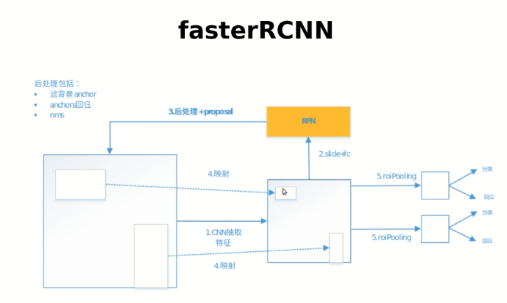
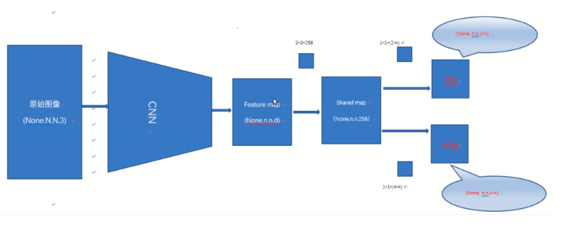
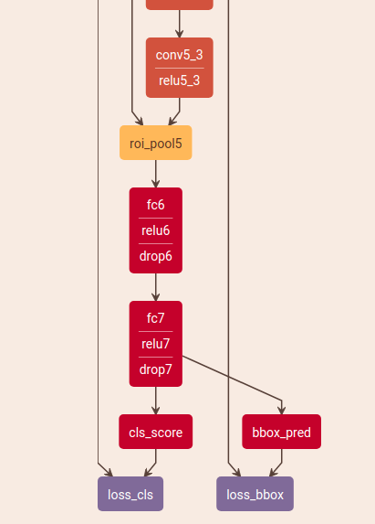

# faster R-CNN

## 解决的问题

​    在检测领域R-CNN常分为两个部分，一个是region proposal，另一个是后续的神经网络用于分类以及对目标所在位置进行回归精准定位（fast rcnn）。之前的研究在region proposal问题上使用的是selective search，严重限制了整个检测网络的速度。产生候选区域的网络所需时间大概是后续分类与回归网络所需时间的10倍。faster rcnn提出了一种新的产生候选区域的网络RPN(region proposal network),提升速度，同时RPN可以与fast rcnn构成端到端的网络(端到端学习有什么优势？如果不采用端到端学习，优化时将会面临问题，每个子模块分开优化，无法得到整个系统的最优解。

## 实现方法

​    注: faster rcnn只是对产生候选区域的网络进行了改进(selective search --> RPN），其余都是沿用fast rcnn网络。

### Faster R-CNN完整流程

​	上图标注了faster Rcnn 的步骤，可见，RPN与后续的fast rcnn是有交叠的，即提取feature map（vgg or resnet等网络完成）部分，这也就是论文中说的share部分。

### RPN网络

​	RPN就是先通过vgg或者resnet提取feature map，然后在feature map上应用anchors，再将feature map再进行一步卷积操作得到share map。最后再以share map作为输入训练cls与reg。（可以理解为将anchors作为输入）

##### 如何训练分类

​	分类需要准备的有训练集data以及label，如今data就是anchors，那么如何得到label呢？

​	label的标注有两种标注方法，第一种是将IOU（与ground truth的交并比）最高的框（一个anchor包含9个框），标为1，第二种方法，高于0.7的标为1.因为第二种可能存在没有超过0.7的情况，所以采取第一种。同时，将低于0.3的标为0，其余的在clas阶段用不到。分类时采用softmax。

##### 如何训练回归

​	regression阶段：对框的修正分为两步，【注意，首先此处的修正并不是要将框完全与GT重合，而是修正为与GT很接近的框（为什么不直接修正为完全一样的框，好像是差异太大的话修正并不是线性的），其次回归的是修正变换的系数】。第一步，将框的中心进行平移到类GT的中心。第二步，将框进行放缩。

修正的方法 

训练RPN网络的框架图

##### 联合分类与回归的loss function

​	将cls与box联合起来输出为候选框和分数，多目标损失函数 L = L_cls + lamda*L_reg, L_cls采用的是log损失，L_reg采用的是L1损失，即坐标差的绝对值。注：由于一幅图上的anchors太多，在每次计算loss时，只会随机选取一部分进行计算。

## 几个问题

​	原文在并没有给出太多细节解释，还需要看代码，在阅读过程中有一些疑问，先记录下来，等看完源程序再解答。

1. 在classification环节，训练的目的是什么？

   cls的目的是让机器学会哪些是object

2. regression与classification同时进行，那么regression是对哪些框操作？

   两者都是对share map同时进行，通过loss function结合在一起。使得机器不仅要得到最可能是object的anchors，还要学会如何将该anchors reg到近似与ground truth的位置。

## 总结

1. 从论文里给出的效果来看，RPN的proposals为300个，SS为2000个，RPN提出的候选区域比SS要少很多10倍左右，同时mAP比ss高两三个百分点。最重要的是，faster rcnn比fast rcnn快了10倍左右。
2. 论文里的示意图看不懂，这种有share的网络并且数据流动方向还存在回溯的，最好还是像上面那张图一样，标注一下顺序。
