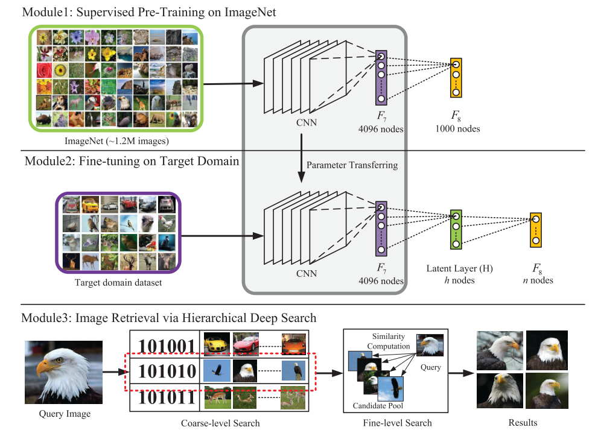
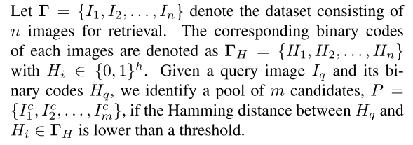
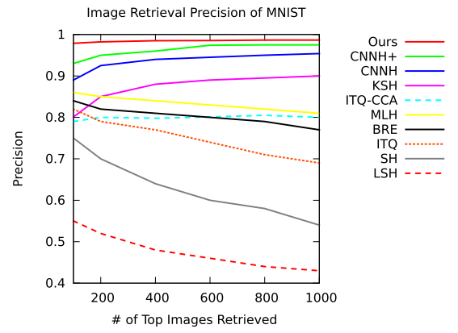

# 1017组会

## 论文阅读

### Deep Learning of Binary Hash Codes for Fast Image Retrieval

- 摘要：Our idea is that when the data labels are available, binary codes can be learned by employing a hidden layer for representing the la- tent concepts that dominate the class labels. The utilization ofthe CNN also allows for learning image representations. Unlike other supervised methods that require **pair-wised** in- puts for binary code learning, our method learns hash codes and image representations in a point-wised manner, mak- ing it suitable for large-scale datasets. 

- 检索策略
  1. coarse-level

​	outH是添加的隐含层的输出值，二值化后得到hash码。

​	首先我们有一个关于待搜索数据集的图片集合，以及相对应的hash码的集合。搜索的策略就是，待搜索图片	所得到的hash码同整个数据集的hash码比较汉明距离，找出距离最小的m个。

​         2. fine-level

F7的输出 和In计算欧氏距离，并在pool 中取topK.

- 实验结果

  - MNIST数据集

    

    

  - CIFAR-10数据集

    

  - Yahoo-1M

    

### HashNet: Deep Learning to Hash by Continuation∗

- 摘要

  Subject to the ill- posed gradient difficulty in the optimization with sign acti- vations, existing deep learning to hash methods need to first learn continuous representations and then generate binary hash codes in a separated binarization step, which suffer from substantial loss ofretrieval quality. 

  This work presents HashNet, a novel deep architecture for deep learning to hash by continuation method with convergence guarantees, which learns exactly binary hash codes from imbalanced similarity data. 

  The key idea is to attack the ill-posed gra- dient problem in optimizing deep networks with non-smooth binary activations by continuation method, in which we be- gin from learning an easier network with smoothed activa- tion function and let it evolve during the training, until it eventually goes back to being the original, difficult to opti- mize, deep network with the sign activation function.

