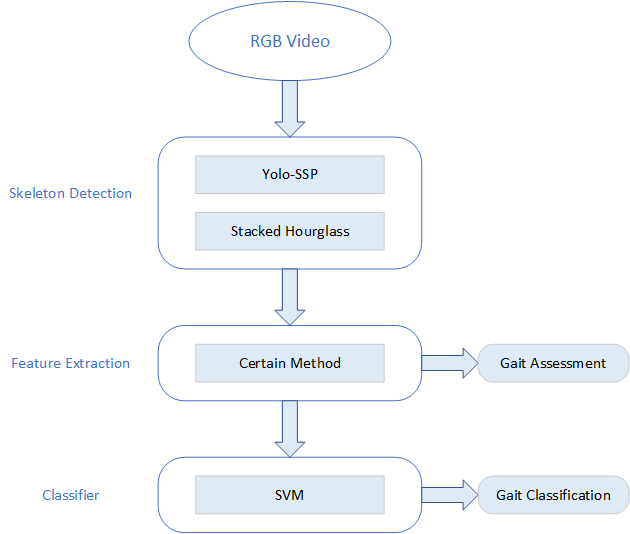

[TOC]

## 快速跳转：

[第一周20190627-20190703](#第一周)

[第二周20190704-20190710](#第二周)

[第三周20190711-20190717](#第三周)

[第四周20190718-20190724](#第四周)

## 20190627-20190703

### 本周总结

#### 论文

* 看Alphapose代码 了解训练tricks
* Stacked hourglass 精度评估
* Fast Human Pose Estimation 训练（ing）
  * 说明distallation可行
  * 调研mobile可考虑
  * 随机剪枝可考虑

#### 会议

http://ieee-cas.org/pubs/tbiocas

已发表列表：

https://ieeexplore.ieee.org/xpl/tocresult.jsp?isnumber=8599184&punumber=4156126

截稿：8.18

思路：

Alphapose+FHPE+FFT+SVM(bayes)

### 下周计划

- 尝试写论文，并列出详细的论文和实验计划

* 复现FHPE，并评估集成到sail的准确度。和原来系统对比

### 待做事项

* 细化分类网络
* 由视频制作数据集，按照mpii标签格式做标签（关键点标签）
* 二分类标签制作，评估医生准确度并做对比
* 评估关键点准确度对分类网络的影响

## 20190704-20190710

### 1.论文进度

### 2.实验进度

#### 20190704还有45天

* Fast human pose estimation：
  * pytorch实现：https://github.com/yuanyuanli85/Fast_Human_Pose_Estimation_Pytorch

* Stacked Hourglass Network：
  * Pytorch实现：https://github.com/bearpaw/pytorch-pose
  * 作者原站：https://github.com/princeton-vl/pose-hg-train
* Stacked+mobile+fpd：
  * pytorch：https://github.com/yuanyuanli85/Fast_Stacked_Hourglass_Network_OpenVino

其实今天自己本身还是有些迷茫，屡不清整体思路，既然如此，打算明天开始写论文，在写论文的过程中缕清思路，发现自己应该做的事情，但是实验先不能断，先把实验跑起来。

#### 20190705还有44天

* hourglass源码实验进度epoch46/90，精度已经到了83.46%，感觉还在持续提高，训练完还需要几天
* hourglass压缩后模型下载进行evaluation结果：

原作者提供结果：

| Model|in_res |featrues| # of Weights |Head|Shoulder|	Elbow|	Wrist|	Hip	|Knee|	Ankle|	Mean| GFlops | Link|
| --- |---| ----|----------- | ----| ----| ---| ---| ---| ---| ---| ---|----| ----|
| hg_s8_b1|256|128|25.59m| 96.59| 95.35| 89.38| 84.15| 88.70| 83.98 |79.59| 88.33|28|[GoogleDrive](https://drive.google.com/open?id=1yzR8UwhklJTMMJEtjK10oyYG1tVRtkqi)|
| hg_s2_b1_mobile|256|128|2.31m|95.80|  93.61| 85.50| 79.63| 86.13| 77.82| 73.62|  84.69|3.2|[GoogleDrive](https://drive.google.com/open?id=1FxTRhiw6_dS8X1jBBUw_bxHX6RoBJaJO)|
| hg_s2_b1_mobile_fpd|256|128|2.31m| 95.67|94.07| 86.31| 79.68| 86.00| 79.67|75.51| 85.41|3.2|[GoogleDrive](https://drive.google.com/open?id=1zFoecNCc7alND8ODh8lg3UeRaB6_gY_V)|
| hg_s2_b1_mobile_fpd_unlabeled|256|128|2.31m| 95.94|94.11| 87.18| 80.69| 87.03| 79.17|74.82| 85.69|3.2|[GoogleDrive](https://drive.google.com/open?id=1mSFD2cn8fMb1YQJPOjfU-RLVnYO1LoAl)|

自己复现结果：

| Model|in_res |featrues| # of Weights |Head|Shoulder|	Elbow|	Wrist|	Hip	|Knee|	Ankle|	Mean| GFlops | Link|
| --- |---| ----|----------- | ----| ----| ---| ---| ---| ---| ---| ---|----| ----|
| hg_s8_b1|256|128|25.59m| 96.59| 95.35| 89.38| 84.15| 88.70| 83.98 |79.59| 88.33|28|[GoogleDrive](https://drive.google.com/open?id=1yzR8UwhklJTMMJEtjK10oyYG1tVRtkqi)|
| hg_s2_b1_mobile|256|128|2.31m|95.80|  93.61| 85.50| 79.63| 86.13| 77.82| 73.62|  84.69|3.2|[GoogleDrive](https://drive.google.com/open?id=1FxTRhiw6_dS8X1jBBUw_bxHX6RoBJaJO)|
| hg_s2_b1_mobile_fpd|256|128|2.31m| 95.67|94.07| 86.31| 79.68| 86.00| 79.67|75.51| 85.41|3.2|[GoogleDrive](https://drive.google.com/open?id=1zFoecNCc7alND8ODh8lg3UeRaB6_gY_V)|
| hg_s2_b1_mobile_fpd_unlabeled|256|128|2.31m| 95.94|94.11| 87.18| 80.69| 87.03| 79.17|74.82| 85.69|3.2|[GoogleDrive](https://drive.google.com/open?id=1mSFD2cn8fMb1YQJPOjfU-RLVnYO1LoAl)|
#### 20190707还有42天	

* 今天看yolov3的pruning部分并没有开源，连训练好的模型都没有开源，没有办法复现，所以先放下这一部分

* 看FHPE：

  思路：

  train：

  1.用sail数据集去训练FHPE网络，并进行评测（涉及到数据集的制作，比较麻烦，晚上做）

  evaluation：

  1.用MPII训练好的模型对sail数据集进行准确度测试

  2.用训练好的模型进行速度测试。和原来模型作对比。

  * 用原来的模型进行python video_demo.py，速度为` 415/415 [01:10<00:00,  5.91it/s]`
  * 看了一下FHPE的输入实现也太粗糙了吧，和alphapose有很大的不同，首先alphapose是先对目标做的检测，然后再将检测后的图像risize之后输入，而且resize过程中不改变图像的比例，但是在FHPE中简单粗暴的使用了cv2.resize，所以其实两者训练时候的输入就很不一样了，FHPE并没有做单人的裁剪，是整张图像的输入。

* exp1

  * mpii数据集根本不是单人数据集啊，，醉了，25204个人，2958个valid person，2729个valid images，其中只有1205张单人图片，1524张多人图片，如果输出只是单人的话，那还搞毛哦
  * 先用demo运行了所有的valid并分开单人，多人存储，发现多人结果直观上很差，单人结果其实也不见得好。
  * 用hg_s2_b1_mobile做测试模型，用mpii_valid中单人的数据做valid，精度是0.8325，用mpii_valid中的多人图片做测试，精度是0.8045。和直观观察差别较大。
  * 可视化valid输入到网络的图片，

#### 20190708还有41天

今天打算：

* 看FHPE中MPII的预处理方式
* 把FHPE集成到alphapose中，看一下处理速度，在coco上做一下valid
* 论文写个开头
* 把师弟给的结果看一下并给出反馈

明天：

* 可以的话，用MPII数据集进行先框选（可以是yolo或者gt）然后去训练FHPE

### 3.其他

## 20190711-20190718

* 周总结
  * 把gait,gait skeleton,parkinson相关文章做了一些调研，把自己需要借鉴的部分进行了标注
  * 列出论文大纲
  * 写一个视频播放器去做数据标注（因为想具体到帧）
  * 杨东勃师弟帮助做的事情
    * SVM分类网络做ROC分析--已完成
    * 从视频和关键点文件生成数据集，数据集包括图片和coco格式h5标注文件--正在进行
    * 404视频数据的标注--正在进行
  * 蒋毅师弟帮助做的事情
    * 404视频数据的标注--正在进行

* 周计划
  * 完成404视频标注
  * 完成英文论文框架（除去实验分析）
* 论文计划
  * 7/18-7/24：论文框架完成（找时老板review，修改，找乔莎老师review），视频标注
  * 7/25-7/31：coco实验+结果分析+论文修改
  * 8/1-8/7：feature extraction部分实验+结果分析+论文修改
  * 8/8-8/14：classifier部分实验+结果分析+论文修改
  * 8/14-8/18：整体论文迭代修改

## 20190719-20190725

* 周总结

  * 标数据

  * 看论文

  * 写论文

    下不去手，，，呜呜呜

    

* 周计划

  * 写完论文的method部分并完成实验的1/3