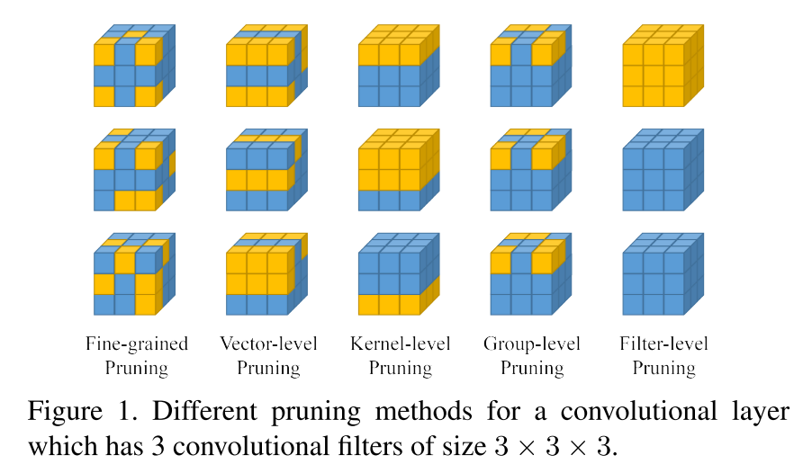
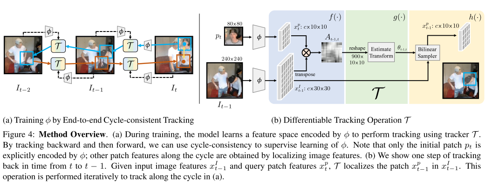
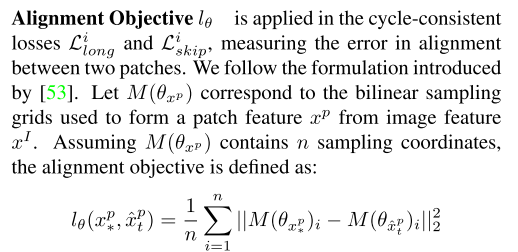

<<<<<<< HEAD
[TOC]

[第三周](#第三周)

[第四周](#第四周)

# 分周计划

## 20190404-20190410

### 周总结

* 步态算法监视程序重构，逻辑线更清楚
* 模型压缩相关知识，并参与比赛
* 出差布点
* 课程报告相关准备

## 20190411-20190417

### 周计划

- 模型压缩
- 协助完成语音收集
- 按照计划出差布点
- 看论文
- 课程报告

### 周总结

* 模型压缩看了一些，但是没有看很多，半篇论文（deep compression），研究了几个代码
* 语音收集完成一个人，主动来找的人
* 做实验室网页：<http://webplus.fudan.edu.cn/_s342/main.psp>
* 做课程报告：英语&计算机体系结构
* 总结：这周较多时间花在了实验室网页制作和课程上，关于deep compression的进度较慢，论文和代码方面花费精力较少。下周应作出相应调整

##  20190418-20190424 

### 周计划

* 论文：至少两篇（拿人头保证）
* 调研：完成模型压缩调研报告和三维恢复方向调研报告
* 实验室网页优化

### 周总结

* 实验室网页优化（完成，偷了研究生招生网站的模板，看起来正规了很多，好开心）
* 出差两天
* 语音数据采集完成
* 调研报告：
  * 发现要看的论文好多好多，未完成

* 论文阅读

| 论文分类                   | 论文名称                                                     | 阅读状态 | 时间 |
| -------------------------- | ------------------------------------------------------------ | -------- | ---- |
| 模型压缩                   | Deep Compression: Compressing Deep Neural Networks with Pruning, Trained Quantization and Huffman Coding | 完成     | 本周 |
| 模型压缩综述               | Recent Advances in Efficient Computation of Deep CNN，2018CVPR | 一半     | 本周 |
| 轻量级网络                 | Light-Head R-CNN: In Defense of Two-Stage Object Detector    | 完成     | 本周 |
| 轻量级网络                 | ShuffleNet: An Extremely Efficient Convolutional Neural Network for Mobile Devices | 一半     | 本周 |
| 其他一些轻量级网络粗略阅读 |     | 粗略了解 | 本周 |

* 代码工作：

| 参考                                                       | 备注                                                         | 代码实现结果                       |
| ---------------------------------------------------------- | ------------------------------------------------------------ | ---------------------------------- |
| Learning Correspondence from the Cycle-consistency of Time | 因为这篇论文用仿照cycle gan的方式训练网络，不需要标签，得到了一个用于检测，分割，关键点检测的网络，所以想用我们的数据集测试一下是否可行 | 失败，搞了一天，环境配置失败，放弃 |

## 20190425-20190501

### 周计划

- 多看模型压缩的论文并作出总结

  > 本周感兴趣论文
  >
  > 模型压缩方面两篇综述
  >
  > 
  >
  > 轻量级网络，据说打败yolov3
  >
  > 
  >
  > 上周复现失败的论文，想看看到底有没有价值：
  >
  > 

### 周总结

* 论文阅读

| 论文分类                           | 论文名称                                                     | 笔记                | 备注                            |
| ---------------------------------- | ------------------------------------------------------------ | ------------------- | ------------------------------- |
| 模型压缩综述                       | Recent Advances in Efficient Computation of Deep CNN，2018CVPR | [简单笔记](#论文一) | 4.25                            |
| 无监督学习时间上的图像一致性       | Learning Correspondence from the Cycle-consistency of Time,2019CVPR | [简单笔记](#论文2)  | 4.26，历时2.5小时，没看实验部分 |
| 速度和准确率都吊打Yolov3的目标检测 | CornerNet-Lite: Efficient Keypoint Based Object Detection,2019CVPR | [简单笔记](#论文三) | 4.26                            |
|                                    |                                                              |                     |                                 |
|                                    |                                                              |                     |                                 |

### 详细

****

#### 1.Recent Advances in Efficient Computation of Deep CNN，2018CVPR

* **Motivation**

  >神经网络的计算复杂度，资源消耗逐年激增，那应用起来功耗和速度都不行啦，所以要加速撒，本文从**算法**和**硬件**两个方面的加速方法作了总结。
  >
  >**算法方面**：network pruning，low-rank approximation，network quantization，teacher-student networks，compact network design
  >
  >**硬件方面**：硬件加速器

* **算法方面的加速**

  * **Network Pruning** 

    

    * Fine-gained Pruning
    * Vector-level and Kernel-level Pruning Vector-level
    * Group-level Pruning Group-level
    * Filter-level Pruning Filter-level

    * **low-rank approximation**

        * Two-component Decomposition 

          **SVD**: w\*h----w\*1,1*h

        * Three-component Decomposition

          Typical:w\*h----w\*1,1\*h,1\*1

          Tucker decomposition:w\*h----1\*1,w\*h,1\*1,其中w\*h变成了block diagonal tensor

          BTD:low-rank，group sparse decomposition

        * Four-component Decomposition
          Typical:w\*h----1\*1，w\*1,1\*h,1\*1,和CP-decomposition相似

    * **network quantization**

        * Scalar and Vector Quantization Scalar

          code book--quantization codes

          1. 无损编码：Huffman

          2. low-bit fixed points

          1. Scalar: K-means
          2. vector:PQ(主要用于FC)

        * Fixed-point Quantization

          主要从Weights,Activations下手来对inference阶段加速或者降低功耗，也有对Gradient动手的，为了在training阶段优化。

          作者举了一堆网络的例子，具体看论文吧

    * **teacher-student networks**

      KD----FitNets----[91]

      KD:(knowledge distillation)，用teacher的softmax层的输出，也就是feature maps指导学生

      FitNets:deeper

      \[91\](Paying more attention to attention):用teacher的attention maps去指导学生

    * **compact network design**

      1. Network-In-Network: 运用1*1卷积增大网络能力，保证计算复杂度

      2. 为了减少storage，用global average pooling代替fully  connected layer

      3. Branching：

         >* 在GoogLeNet中被提出
         >
         >* SqueezeNet:用1*1卷积和branching
         >* MobileNet：提出depth-wise convolution，结合1*1卷积得到很好效果
         >* ShuffleNet：更好的降低1*1的复杂度是用multiple groups，引入channel shuffle operation增加各个group之间的信息互换

  * **硬件方面的加速**

  * **未来方向**

    1. Non-fine-tuning or Unsupervised Compression

       确实，如果能不需要fine-tuning就可以达到压缩模型但是不降低精度的方法，那么就会是一种通用的方法，网络应该自己去寻找有没有用的参数，但是目前来看，参数有没有用还是由标签给出的监督，所以要想做到自监督去学习，感觉可以参考cycle-gan的思想。包括最近出来的一个Learning Correspondence from the Cycle-Consistency of Time，我们可以写一个Learning to compress from ……

    2. Scalable (Self-adaptive) Compression

       超参数的选取耗费人力，如果网络能自己学习到这些参数就好了

    3. Network Acceleration for Object Detection

       目前压缩只是在object classification表现比较好，但是在detection或者segmentation或者其他方面效果并不好，可能是因为其他任务需要更多的语义信息。

    4. Hardware-software Co-design

****

#### 2.Learning Correspondence from the Cycle-consistency of Time, 2019 CVPR

先说一下，看到了后面才发现这个是需要第一帧给出标签的，表示很失望，我还以为不需要标签呢，哭……

* **Motivation：**

  利用什么循环一致性，cycle-consistency

  correspondence是计算机视觉的基础，所以想找个办法表示他。

  从pixel-wise到object-level，已经有很多方法，监督学习需要大量标签，学习一些低级别表示比如光流用了很多计算机图像，所以到真是物体效果不好，我们要用无监督方式从头开始得到一致性的表示。

  在几乎静止的视频中学习correspondence是容易的，但是在动态世界里不容易，因为**学习视觉不变性需要跟踪，而跟踪又依赖于视觉不变性模型**。

* **Main idea：**

  主要思想是先拿出一小段时间的视频，从第一帧tracking到最后一帧，然后再tracking回来，将第一帧和tracking到最后的结果做loss function。

  但是因为tracking可能会经常失败，所以允许跳帧，用到**skip-cycles**，从不同时间尺度上进行tracking，丰富样本量。

* **Details**(示意图很清楚)

  * **pipeline：**

  

  * **Loss function**

  

  ​	其中：

  

****

#### 3. CornerNet-Lite: Efficient Keypoint Based Object Detection，2019CVPR

* **Motivation**

  作者在2018CVPR提出的CornerNet在精确度上达到了很高(42.2%)，但是速度上贼慢(1.147s/f)，所以就开发了一个CornerNet-Lite，以达到速度上的优化。

* **Main idea**

  提出了两个网络：

  * CornerNet-Saccade：43.2%，190ms

    >* 在低分辨率的整张图像上产生一个attention map，然后放大到高分辨率裁剪之后进行检测
    >
    >* 前任工作如Faster RNN在每个crop上只detect一个object，或者如AutoFocus在每个crop上加上sub-crops检测多个object，我们的工作可以**在一个crop内单步检测多个物体**。

  * CornerNet-Squeeze：34.4%，33ms

    >* 由SqueezeNet和MobileNets启发，引入一个堆叠沙漏骨干，用大量的1×1 convolution, bottleneck layer, and depth-wise separable convolution.(**此处会不会和Shufflenet的想法有所重合？？**)
    >* 第一次将stacked hourglass结构应用到目标检测。之前有人应用，但是在efficiency上并不好，但是我们做到了比较好，展示了他的应用可能性。

  * 为什么不把saccade和squeeze结合呢？

    >作者实验发现结合的效果并不好（both速度and精度）：
    >
    >1. CornerNet-Squeeze的设计很紧凑，没有多余的容量
    >2. CornerNet-Squeeze因为紧凑的结构设计，是单scale的，没有余量给saccade

* **Related Work**

  * Saccades in Object Detection

    >* R-CNN,Fast R-CNN,Faster R-CNN：剪裁出含有可能物体的区域，Cascade R-CNN(级联分类器和回归器迭代的接受或拒绝crop proposal)
    >
    >* AutoFocus：向Faster R-CNN中加了一个分支去检测含有小物体的regions，再从原图像中裁剪使用Faster R-CNN检测小物体。

  * Efficient Object Detectors

    >* 从**R-CNN**在2000RoI上应用了ConvNet开始
    >* 重复在图像上用ConvNet有很多冗余，**SPP and Fast R-CNN**在图像上用了ConvNet在图像上全卷积，直接从每个RoI的特征图中提取特征。
    >* **Faster R-CNN**通过把低级视觉算法换成region proposal network提高了效率。
    >* **R-FCN**将fully connected sub-detection network替换成a fully convolutional network
    >* **Light-Head R-CNN**：使用separable convolution减少channels
    >* **众多的Onestage detectors**：直接去除region pooling
    >
    >

  * Efficient Network Architectures

    >SqueezeNet  MobileNets  PeleeNet
    >
    >YOLOv2  YOLOv3  RFBNet

# 目前终极目 标

- 7月份一篇期刊论文
  - 想法1：关键点识别应用网络，根据返回的步态视频（color+depth）进行训练，得到目标应用明确的网络，适用于中山医院项目
  - 想法2：模型压缩，根据应用场景，在损失不影响应用效果的精度的情况下，进行模型的压缩
- 11月份一篇会议论文
  - 计算机视觉相关，暂无想法

## 分月计划

### 4月份：

- 完成zte模型压缩大赛，看几篇论文
- 完成深度视频和彩色视频结合方向的调研，找一下数据集，细化想法，评估可行性

### 5月份：

- 搭建论文架构
- 跑实验

### 6月份：

### 7月份：

=======
[TOC]

# 分周计划

## 20190404-20190410

### 周总结

- 步态算法监视程序重构，逻辑线更清楚
- 模型压缩相关知识，并参与比赛
- 出差布点
- 课程报告相关准备

## 20190411-20190417

### 周计划

- 模型压缩
- 协助完成语音收集
- 按照计划出差布点
- 看论文
- 课程报告

### 周总结

- 模型压缩看了一些，但是没有看很多，半篇论文（deep compression），研究了几个代码
- 语音收集完成一个人，主动来找的人
- 做实验室网页：<http://webplus.fudan.edu.cn/_s342/main.psp>
- 做课程报告：英语&计算机体系结构
- 总结：这周较多时间花在了实验室网页制作和课程上，关于deep compression的进度较慢，论文和代码方面花费精力较少。下周应作出相应调整

## 20190418-20190424

### 周计划

- 论文：至少两篇（拿人头保证）
- 调研：完成模型压缩调研报告和三维恢复方向调研报告
- 实验室网页优化

# 目前终极目标

- 7月份一篇期刊论文
  - 想法1：关键点识别应用网络，根据返回的步态视频（color+depth）进行训练，得到目标应用明确的网络，适用于中山医院项目
  - 想法2：模型压缩，根据应用场景，在损失不影响应用效果的精度的情况下，进行模型的压缩
- 11月份一篇会议论文
  - 计算机视觉相关，暂无想法

## 分月计划

### 4月份：

- 完成zte模型压缩大赛，看几篇论文
- 完成深度视频和彩色视频结合方向的调研，找一下数据集，细化想法，评估可行性

### 5月份：

- 搭建论文架构
- 跑实验

### 6月份：

### 7月份：

>>>>>>> 008bb65435b66ba191c15489795fa7a70285ba9e
