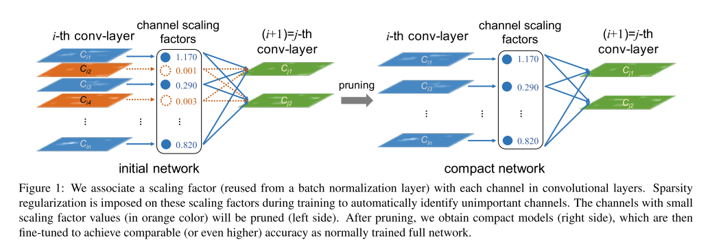

[TOC]

## 快速跳转

[第一周20190502-20190508](#第一周)

[第二周20190509-20190516](#第二周)

## 20190502-20190508

### 周计划

* 完成统计学习的课程报告
* alphapose架构分析已经重新训练
* 模型压缩论文

### 周总结

* 论文阅读

  | 论文分类     | 论文名称                                                     | 阅读状态                  | 时间 |
  | ------------ | ------------------------------------------------------------ | ------------------------- | ---- |
  | 模型压缩综述 | A Survey of Model Compression and Acceleration for Deep Neural Networks，2017 CVPR | [简单笔记](#第一周论文一) |      |

* 资料阅读

  [模型压缩总览]( http://www.sohu.com/a/232047203_473283)

  [详细笔记](#详细笔记)

#### **1. A Survey of Model Compression and Acceleration for Deep Neural Networks，2017 CVPR**

* **Motivation**

  

* **Main idea**

* **Parameter pruning and sharing**

  * **Quantization and binarization**

    * [6-2014CVPR-Compressing Deep Convolutional Networks using Vector Quantization](https://arxiv.org/abs/1412.6115)

      * 这篇论文主要针对全连接层进行压缩，之前的方法都是采用矩阵分解方法，但是本篇采用了向量量化方法。在参数值上用kmeans方法，得到了8-16倍的压缩，0.5%的精度损失。进一步用结构量化方法，得到24倍压缩，1%精度损失。

      * 矩阵分解方法（数学真重要）
  
        我们使用[SVD](<https://blog.csdn.net/u011251945/article/details/81362642>)来分解参数矩阵，，其中W是原始全连接层权重矩阵，大小是m*n，分解后可得到U为m\*k，S是k\*k的对角矩阵，V为n\*k，所以压缩比是mn/k(m+n+1)
  
      * **向量分解方法**（本文使用）
  
        * 二值化BINARIZATION
          
  
          这种方法可以对数据进行32倍的压缩，因为二值化。
  
        * 使用kMEANS的标量量化SCALAR QUANTIZATION USING kMEANS
  
          就是用kmeans方法做了个聚类，但是这句话感觉不对吧，，这只能说是index的压缩，权重包含进去的话压缩率肯定没这么高啊，搞笑~
  
        * 乘法量化PRODUCT QUANTIZATION
          结构化向量量化
  
          其实就是把一个m*n的矩阵按照列分成s片，那么每一片都是m\*n/s，将每一片的一行看成kmeans聚类中的一个元素，也就是以一个1\*n/s长度的向量来聚类，最后理论压缩率是(32mn)/(32kn + log2(k)ms)
  
    * [7-2015CVPR- Quantized convolutional neural networks for mobile devices](https://arxiv.org/abs/1512.06473)
  
      6,7两篇文章都采用了k均值聚类算法来量化参数的值，k均值聚类算法可参考
  
    * k-means scalar;8-bit;16-bit;
  
      > 韩松提出的：普通学习——剪枝权重小的网络——用huffman编码剩余权重——重新训练refine一下现存连接
      >
      > hessian weight能表示网络参数的重要性：提出新的聚类方法，通过最小化hessian权重量化误差。
      >
      > 1-bit
    
      1-bit Drawback：
  
      ​	1.在处理大的CNN网络如GoogleNet时精确度会很差
  
      ​	2.现存的二值化框架基于简单的矩阵近似，忽略了二值化对精度的影响
  
      为了解决上述问题：
  
      [16]近似牛顿算法，对角海森近似，直接最小化二值化权重的损失
  
      [17]的工作通过随机二值化权值和将隐状态计算中的乘法转换为显式的变化，减少了训练阶段浮点数乘法的时间
  
  * **Pruning and Sharing**
  
    之前用来解决过拟合问题
  
    早期方法：
  
    > Biased Weight Decay
    >
    > Optimal Brain Damage [19] and the Optimal Brain Surgeon [20]:降低连接的数目，并且说pruning之后的精度可能会更好
  
    现在方法1：剪枝预训练CNN模型
  
    >以前的方法都是从头训练，现在流行一种**剪枝预训练模型的方法**
    >
    >韩松论文相当于之前方法一个总结：先移除多余连接，量化权重，最后权重聚类，用Huffman编码。
    >
    >基于soft weight-sharing的一种正则化方法
  
    现在方法2：训练紧凑的具有稀疏约束的CNN
  
    >稀疏约束是在正则化中被引入的，如l0正则化或者l1-norm正则化。
    >
    >[25]得到的群稀疏性约束，可以让我们进行group-wise fashion的操作
    >
    >[26]group-sparse regularizer
    >
    >[27]在每一层加上了一个结构化洗漱正则器。
  
    Drawback：
  
    l1,l2正则化比一般需要更多的迭代次数去收敛
  
    所有层需要手动设置敏感度，所以需要fine-tuning
  
  * **Designing Structural matrix**
  
    全连接层一直是瓶颈
    
    定义：x变为一个参数化结构矩阵，M变为比m*n表示稀疏得多的结构矩阵，不仅可以减少参数数量，还可以加速训练和推论的速度。
    
    循环预测：

****

#### 模型压缩总览阅读

[阅读资料](http://www.sohu.com/a/232047203_473283)

* 目前方案：

  低秩近似（low-rank Approximation），网络剪枝（network pruning），网络量化（network quantization），知识蒸馏（knowledge distillation）和紧凑网络设计（compact Network design）

* Low-rank：

  Previous low-rank based methods:

  [张量分解](<https://blog.csdn.net/flying_sfeng/article/details/87453217>)

  * SVD

    > *Zhang, Xiangyu, et al. "Accelerating very deep convolutional networks for classification and detection." *IEEE transactions on pattern analysis and machine intelligence* 38.10 (2016): 1943-1955.*

  

Tensor分解：

  * CP decomposition
  
    >Lebedev, Vadim, et al. "Speeding-up convolutional neural networks using fine-tuned cp-decomposition." 2014-CVPR . 
    >
    >[张量的CP分解](<https://zhuanlan.zhihu.com/p/25067269>)
    >
    >
* Tucker decomposition
  
    >Kim, Yong-Deok, et al. "Compression of deep convolutional neural networks for fast and low power mobile applications." 2015-CVPR.
    >
  >[张量的Tucker分解](https://zhuanlan.zhihu.com/p/24798389)
    >
  >
  
    * Tucker分解和CP分解的对比 
  
    CP分解是Tucker分解的特殊形式
  
    
  
      
  
  * Tensor Train Decomposition
  
    >Novikov, Alexander, et al. "Tensorizing neural networks." *Advances in neural information processing systems*. 2015.
    >
    >* [ref](<https://blog.csdn.net/flying_sfeng/article/details/87453217>)
    >
    >* Tensor-train Decomposition将原来的高维张量分解为多个三维张量的乘积（首尾张量为二维）
    >
    >  
    >
    >
  
  * Block Term Decomposition
  
    >Wang, Peisong, and Jian Cheng. "Accelerating convolutional neural networks for mobile applications." *Proceedings of the 24th ACM international conference on Multimedia*. ACM, 2016.
    >
    >* [ref]([http://www.xiongfuli.com/%E6%9C%BA%E5%99%A8%E5%AD%A6%E4%B9%A0/2017-06/tensor-decomposition-BTD.html](http://www.xiongfuli.com/机器学习/2017-06/tensor-decomposition-BTD.html))
    >
    >* ref中的一个思考很有意思，就是说CP分解中是讲一个稀疏张量分解为R个秩一张量相加，但是不同秩、或者说不同尺度的特征是不同的，这时候CP分解无法直观做到。将秩一张量换成秩k矩阵，那么就得到了BTD模型
    >
    >* 
    >
    >  其中，
    >
    >  
    >
    >* 所以L，M，N怎么确定？
  
  为什么low-rank不再流行？
  
  * 对1*1卷积无效率
  * 在bottleneck结构中3*3卷积的计算复杂度并不大
  * 深度卷积，组卷积已经很快了
  
* Pruning

  ICLR2017斯坦福提出deep compression方法，但是随机剪枝对硬件非常不友好，所以就是用成块出现的pruning方法。

  * Structured pruning

    ****
    
    **对weights**
    
    >combined group and exclusive sparsity for deep nerual networks, 2017ICML
    >
    >* [补充数学知识-非凸正交正则化](<https://www.docin.com/p-1216479127.html>):有点太数学化了，看不下去
    >
    >* [补充数学知识-正则化]：看的链接找不到了，但是分享资料满天飞，随便看
    >
    >* [补充数学知识-理解凸优化](<https://zhuanlan.zhihu.com/p/37108430>)：讲的不错
    >
    >* 论文阅读：
    >
    >论文提出了对权重进行分析剪枝我的方法，首先用Group Sparsity组稀疏的方法对分组特征添加稀疏正则来修剪掉权重矩阵的一些列，然后通过Exclusive Sparsity增强不同权重之间特征的竞争力来学习更有效的filters，两者共同作用取得了很好的Pruning结果。
    >
    >
    
    ****
    
    **对feature map和activation**
    
    >Learning Efficient Convolutional Networks through Network Slimming，2017ICCV
      >
    >
      >
    >论文思想很简单，给每个通道channel添加一个尺度因子scaling factor，然后对这些尺度因子scaling factor添加sparsity regularization，最后根据尺度因子大小对相应的通道channels进行修剪，将一些尺度因子比较小的通道剪掉，实现对整个网络的瘦身效果。
    
    ****
    
    **对gradients**
    
    >
    >
    >
    
      
    
  * Filter Pruning 
  
  * Gradient Pruning
  
  * Fine-grained Pruning in a Bayesian View
  
    

 

## 20190509-201905015

### 周计划

- 完成统计学习的课程报告
- alphapose架构分析已经重新训练
- 模型压缩论文

### 周总结

* 统计学习的课程报告完成，细看略看了一些论文，压缩的主要框架，常用方法了解得差不多了，下周可以给大家作报告

- alphapose代码研究

  - sppe重新训练

    sppe重新训练分为两个步骤：用coco2017数据训练，加上PNG（对数据进行随机生成）训练，现在只实现了第一个部分，计划实现第二部分训练的同时对第一部分进行压缩，测试准确度等。

  * Pytorch学习时的一些启发
    * 步态数据训练时候对于分类数据进行one-hot编码
    * 步态数据对于正常数据进行标准化 
    * 关于风格的loss定义和内容的loss定义