[TOC]

## 快速跳转：

[20200210](#2.1)

[20200217](#2.2)

## <span id="2.1">20200210</span>

### 1. Works

#### 1.1. Column combining:

* 实现了简单的LSTM column combine，针对mnist手写数字检测任务：精度不下降

  详见 [LSTM+pruning+column combine](https://github.com/luckyqsz/BCRC-ASAGroup/blob/master/Yanhong%20Wang/2020/20200116%20lstm%2Bprune%2Bcolcombine.pptx)

* 中山医院404数据标注+新参数机器标注
* 中山医院论文method部分（修改中）

share：https://cbovar.github.io/ConvNetDraw/

这个操作起来十分简单，只需要输入如下卷积神经网络结构说明:

```
# Some example

input(28, 28, 1)
conv(24, 24, 8)
relu(24, 24, 8)
pool(12, 12, 8)
conv(10, 10, 16)
relu(10, 10, 16)
pool(4, 4, 16)
fullyconn(1, 1, 10)
softmax(1, 1, 10)
```

便可生成对应的网络结构，即：


## <span id="2.2">20200217</span>

### 1. Work

### 2. Papers

#### 2.1. Pruning from Scratch

- **Info:**

  --2020AAAI 

  --1Tsinghua University 2Ant Financial 3Huawei Noah’s Ark Lab

- **Related work:**

  - Network Slimming

    This work belongs to network pruning filed, based on *Network Slimming*.  

- **Proposed method:**

  - Here is a picture clearly indicating this work. (a) Traditional network pruning pipeline fine-tune the pre-trained big model to get a pruned model. (b)Network pruning pipeline directly pruned on the pre--trained big model, then trains the pruned model frome scratch. (c)Our work proposed a pre-training-free network pruning pipeline, which directly pruns the model from random weights on original big model through some training on channel weights. After pruned, the model can be trained from scratch. 

    

  * 通过优化一个关于channel-gate-value的函数，对channel的附加权重进行更新，最后得到每个channel的权重，再根据这个权重进行channel裁剪。（重点在于W是不更新的，而且是随机赋值）

    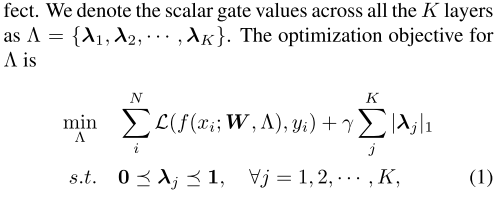

- **My views:**

  - **Advantages:**
    1. This work efficiently avoid the cumbersome pre-training process, speed up the time to get pruned model.
    2. Pruned from initial random weight, this pipeline can explore a larger structure space.
  - **More:**
    1. directly object to the best paper of ICLR 2019---**《The Lottery Ticket Hypothesis》**, awesome~
    2. Mark: this work is based on **《Network Slimming》**, which should be read recently.
    3. Pruned from initial random weight, this pipeline has formed very different pruned model structure because of different initial methods, which means the task itself doesn't need such a big model. The pruning is only used to get a more reasonable structure. Is this phenomenon limited to simple task?
    4. In this work, we can observe that from the very begin of training, the pruned structure can be constant. This is meaningful for big network training and 

#### 2.2.DARB: A Density-Adaptive Regular-Block Pruning for Deep Neural Networks**

- **Info:**

  --2020AAAI 

  --1Alibaba DAMO Academy    2 Northeastern University

- **Related work:**

  - Irregular Pruning:

    decoding one index requires a search over the whole activation vector, and thus it brings little acceleration and even speed degradation.

    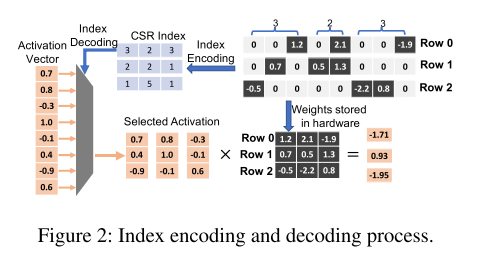

  - Structure Pruning:

    1.enforce all rows in the weight matrix to have the same number of weights retained

    2.group neighboring weights into certain structures

- **Proposed method:**

  * Guess and experiments:

    * The row density distributions vary significantly not only across different neural networks, but also across different layers within the same network, and even across different rows within the same layer.
    * The dense rows are more sensitive than the sparse rows to further pruning.
    * when dividing all rows into equally sized blocks and selecting in each block one weight with the largest magnitude, these locally salient weights have similar salience to the weights globally selected over the whole weight matrix

    | row density distributions                                 | dense rows are more sensitive                             | locally salient weights                                   |
    | --------------------------------------------------------- | --------------------------------------------------------- | --------------------------------------------------------- |
    | 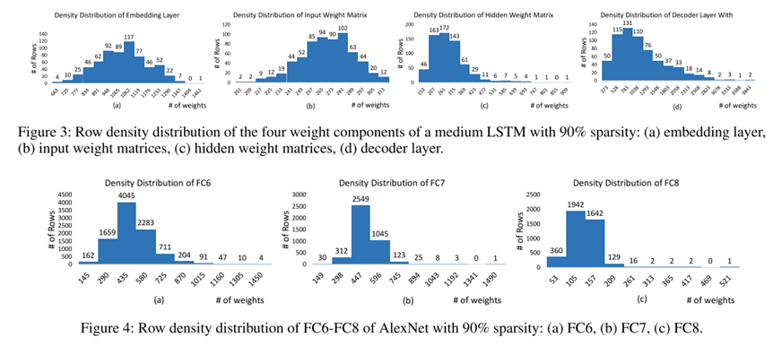 | 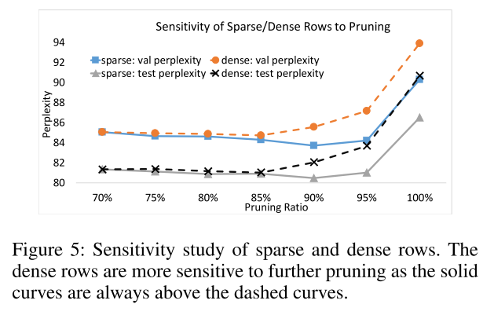 | 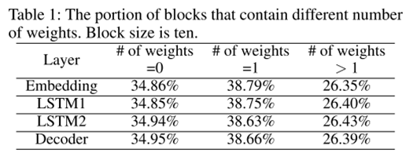 |

    

  * Proposed **BWHM**: block-max weight masking

  * Proposed **DARB**: A Density-Adaptive Regular-Block Pruning based on proposed **BWHM**

    | DARB                                                      | Decoding efficiency                                       |
    | --------------------------------------------------------- | --------------------------------------------------------- |
    | 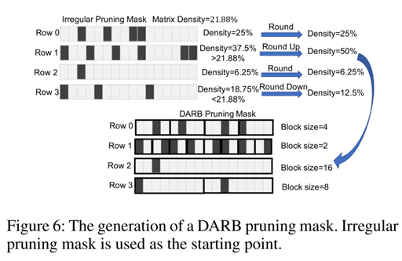 | 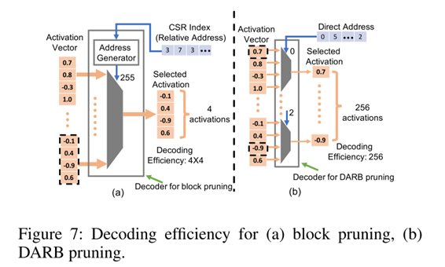 |

  * Experiments:

    | pruning results                                           | decoding efficiency                                       |
    | --------------------------------------------------------- | --------------------------------------------------------- |
    |  | 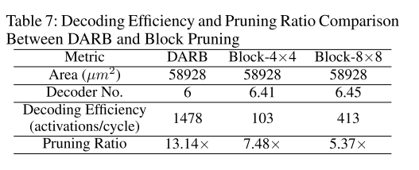 |

    

#### 2.3.Rethinking Full Connectivity in Recurrent Neural Networks

- **Info:**

  -Invidia的一篇论文

  是因为**上篇论文怼这个怼得特别开心所以好奇**才来看这篇的，讲真，我没太懂这篇论文的意思是要干嘛，另外这篇论文好像还没发表出来？

* **Proposed method:**

  文章首先讲了各种RNN的连接方式：

  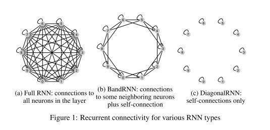

  然后分析了各种RNN连接权重的特点：

  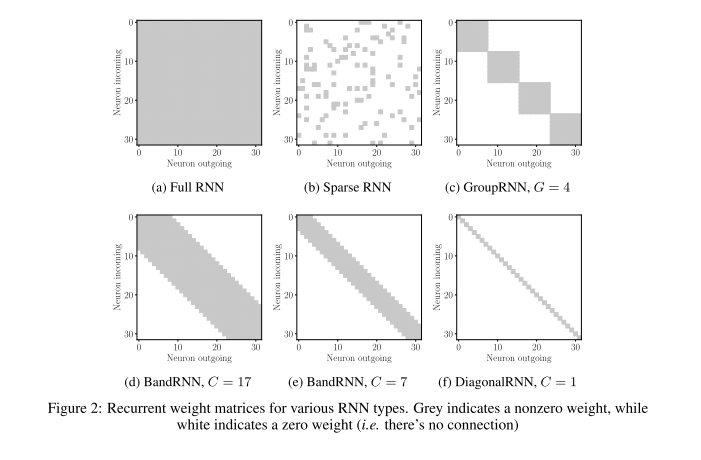

* My view：

  怎么说呢，有种看到**自己的论文**的感觉，找不到文章重心，作者自己的贡献到底是啥最终也没讲清楚，甚至在结论中也是含糊不清。

 ## 20200224

### 1. Papers

#### 1.1 Real-Time Object Tracking via Meta-Learning: Efficient Model Adaptation and One-Shot Channel Pruning

* **Info:**
  Computer Vision Lab., POSTECH, Korea
  
* **Related domain：**

  * Meta-learning：
  * Object Tracking：
  * Channel Pruning：

* **Proposed methods：**

  

  内容略复杂，得边看边缕才能滤清……然后pruning的工作并不是重点，就不缕了……

* **My view**：
  难道是因为投稿率上去了，所以能被发表的论文都没有那么水了？感觉这些论文写的都挺好啊，工作也很完整……

#### 1.2 PCONV: The Missing but Desirable Sparsity in DNNWeight Pruning for Real-time Execution on Mobile Devices
* **Info:**

  * 东北/威廉玛丽/清华合作

  * ref:

    [知乎解读](http://www.ijiandao.com/2b/baijia/342278.html)

* **Related Work:**

  PCONV是目前最快的通用性移动端神经网络加速框架，由美国东北大学（Northeastern University），威廉玛丽学院（William & Mary），和清华大学交叉信息研究院、交叉信息核心技术研究院共同提出。

  **（之前别人的框架）**DNN Acceleration Frameworks on Mobile Platform:TFLite (Ten ), TVM (Chen et al. 2018), Alibaba Mobile Neural Network (MNN) (Ali ), DeepCache (Xu et al. 2018) and DeepSense (Yao et al. 2017).

  这篇文章主要参考ali的[MNN](https://github.com/alibaba/MNN)

* **Proposed method:**

  该框架创新性地提出了神经网络稀疏性结构与编译器的协同优化，提出了新的适合编译器与移动端加速的稀疏化结构：模式化剪枝与连通性剪枝，并且使用交替乘子算法（ADMM）【<font color='red'>讲真，我没看懂这个算法，数学太差了心累</font>】达到稀疏结构。

  * **ADMM（交替乘子优化算法）**

    ADMM将原始剪枝问题分解为两个子问题，用传统梯度下降法求解子问题一，并引入一个二次项迭代求解子问题二。通过实验我们可以发现，该方法在不同量级的神经网络上，比如VGG-16, ResNet-50, MobileNet-V2等代表性网络模型在ImageNet与CIFAR-10数据集上，均取得更好的训练效果（准确率）。

    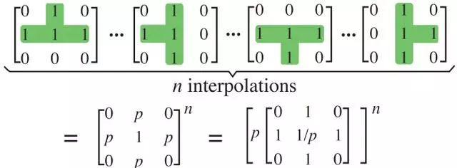

  * **PCONV模型:**

    我们提出了一种新型的剪枝稀疏性结构PCONV，包含了卷积核（convolution kernel）模式化剪枝（pattern pruning）与连通性剪枝（connectivity pruning）

    

  * 我们设计了适合PCONV的移动端推理框架:

    我们通过将相同的卷积核模式排列在一起，同时将拥有相似模式<font color='red'>【如何定义模式的相似性】</font>的输出通道（filter）排列在一起形成一个计算组（group），如图4所示。这种新型排列后的卷积核生成的静态代码能够消除所有代码分支，意味着高指令级平行性，同时，相似的输出通道保证了相当高的负载均衡，从而得到了高线程级平行性。

    

* **My views:**

  * 卷积核与输出通道重排：

    好像最近看的很多论文都隐隐约约使用了这个方法

  * 这个工作非常完整，，，感觉可以参考，，非常漂亮的一篇文章

#### 1.3 LOOKAHEAD: A FAR-SIGHTED ALTERNATIVE OF MAGNITUDE-BASED PRUNING

* **Info:**

  * Conference: ICLR2020
  * author:  Insti：KAIST(Korea Advanced Institute of Science and Technology)
  * code: https://github.com/alinlab/lookahead_pruning

*  **Related work：**

  * **MP**: “magnitude-equals-saliency” approach

*  **Proposed network：**

  MP methods have been proved effective in recent researches. This work better understand the nature of MP methods. By viewing MP as a relaxed minimization of distortion in layerwise operators introduced by zeroing out parameters, we consider a multi-layer extension of the distortion minimization problem. The new method is called lookahead pruning (LAP).

  * Contrbution 1 :  We propose a novel lookahead pruning (LAP) scheme as a computationally efficient algorithm for the minimization of the Frobenius distortion of multi-layer operation。
  * Contribution 2：Although LAP was motivated from linear networks, it extends to nonlinear networks which indeed minimizes the root mean square lookahead distortion assuming i.i.d. activations。
  * Contribution 3：We empirically show its effec- tiveness on networks with nonlinear activation functions, and test the algorithm on various network architectures including VGG, ResNet and WRN, where LAP consistently performs better than MP.

* **My view：**

  很完整。。。。代码很简单，，，实验很多。。。分析比较严谨完整

  代码已公开，可以使用，看完这篇论文我又想回去看机器学习的基本知识了……sad……