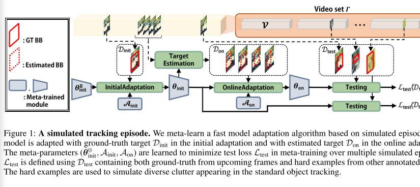
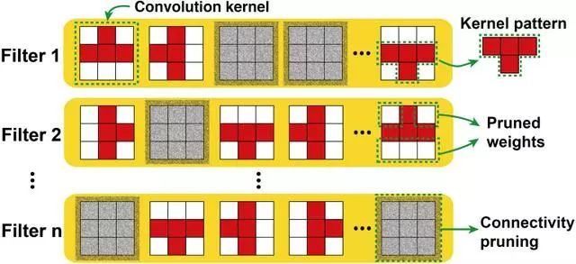

[TOC]

## 快速跳转：

[20200302](#3.1)

[20200309](#3.2)

## 20200302

### 1. Papers

#### 1.1 BERT: Pre-training of Deep Bidirectional Transformers for Language Understanding

* **Info:**
  Google AI Language
  
* **Related domain：**

  * [【NLP】Attention原理和源码解析：](https://zhuanlan.zhihu.com/p/43493999)

  * [【NLP】Transformer详解](https://zhuanlan.zhihu.com/p/44121378)
    * [Sequence to Sequence学习简述](https://www.jianshu.com/p/9bf7178279dc)

  * [【NLP】语言模型和迁移学习](https://zhuanlan.zhihu.com/p/42618178)
  * [【NLP】Google BERT详解](https://zhuanlan.zhihu.com/p/46652512)
  * [李宏毅老师的一些课程](http://speech.ee.ntu.edu.tw/~tlkagk/courses_MLSD15_2.html)
  * [All the ways you can compress BERT](http://mitchgordon.me/machine/learning/2019/11/18/all-the-ways-to-compress-BERT.html?nsukey=eHJM%2BGUiYs6qXlZDlmFREcOz2MH5BWOVeeChDwj1Yk1EyUzBERPxA4JMdFCJM%2Bifjl8UHbEGbTF6M3X2fMeG9CYeRRN55Xbezm3Z%2BDx077StqhxJkFh3e5HF7%2Feju5vfpGF99EIIVa%2BovT5V7hIUWMuQDfkXa177Dds0F5h8G0odZvGebtfVE27t9xYSYOkEAFLW4bleyUC3QtjCuFBM9w%3D%3D)

* **Proposed methods：**

  

  内容略复杂，得边看边缕才能滤清……然后pruning的工作并不是重点，就不缕了……

* **My view**：
  难道是因为投稿率上去了，所以能被发表的论文都没有那么水了？感觉这些论文写的都挺好啊，工作也很完整……

#### 1.2 PCONV: The Missing but Desirable Sparsity in DNNWeight Pruning for Real-time Execution on Mobile Devices
* **Info:**

  * 东北/威廉玛丽/清华合作

  * ref:

    [知乎解读](http://www.ijiandao.com/2b/baijia/342278.html)

* **Related Work:**

  PCONV是目前最快的通用性移动端神经网络加速框架，由美国东北大学（Northeastern University），威廉玛丽学院（William & Mary），和清华大学交叉信息研究院、交叉信息核心技术研究院共同提出。

  **（之前别人的框架）**DNN Acceleration Frameworks on Mobile Platform:TFLite (Ten ), TVM (Chen et al. 2018), Alibaba Mobile Neural Network (MNN) (Ali ), DeepCache (Xu et al. 2018) and DeepSense (Yao et al. 2017).

  这篇文章主要参考ali的[MNN](https://github.com/alibaba/MNN)

* **Proposed method:**

  该框架创新性地提出了神经网络稀疏性结构与编译器的协同优化，提出了新的适合编译器与移动端加速的稀疏化结构：模式化剪枝与连通性剪枝，并且使用交替乘子算法（ADMM）【讲真，我没看懂这个算法，数学太差了心累】达到稀疏结构。

  * **ADMM（交替乘子优化算法）**

    ADMM将原始剪枝问题分解为两个子问题，用传统梯度下降法求解子问题一，并引入一个二次项迭代求解子问题二。通过实验我们可以发现，该方法在不同量级的神经网络上，比如VGG-16, ResNet-50, MobileNet-V2等代表性网络模型在ImageNet与CIFAR-10数据集上，均取得更好的训练效果（准确率）。

    

  * **PCONV模型:**

    我们提出了一种新型的剪枝稀疏性结构PCONV，包含了卷积核（convolution kernel）模式化剪枝（pattern pruning）与连通性剪枝（connectivity pruning）

    

  * 我们设计了适合PCONV的移动端推理框架:

    我们通过将相同的卷积核模式排列在一起，同时将拥有相似模式【如何定义模式的相似性】的输出通道（filter）排列在一起形成一个计算组（group），如图4所示。这种新型排列后的卷积核生成的静态代码能够消除所有代码分支，意味着高指令级平行性，同时，相似的输出通道保证了相当高的负载均衡，从而得到了高线程级平行性。

    

* **My views:**

  * 卷积核与输出通道重排：

    好像最近看的很多论文都隐隐约约使用了这个方法

  * 这个工作非常完整，，，感觉可以参考，，非常漂亮的一篇文章

#### 1.3 LOOKAHEAD: A FAR-SIGHTED ALTERNATIVE OF MAGNITUDE-BASED PRUNING

* **Info:**

  * Conference: ICLR2020
  * author:  Insti：KAIST(Korea Advanced Institute of Science and Technology)
  * code: https://github.com/alinlab/lookahead_pruning

*  **Related work：**

  * **MP**: “magnitude-equals-saliency” approach

*  **Proposed network：**

  MP methods have been proved effective in recent researches. This work better understand the nature of MP methods. By viewing MP as a relaxed minimization of distortion in layerwise operators introduced by zeroing out parameters, we consider a multi-layer extension of the distortion minimization problem. The new method is called lookahead pruning (LAP).

  * Contrbution 1 :  We propose a novel lookahead pruning (LAP) scheme as a computationally efficient algorithm for the minimization of the Frobenius distortion of multi-layer operation。
  * Contribution 2：Although LAP was motivated from linear networks, it extends to nonlinear networks which indeed minimizes the root mean square lookahead distortion assuming i.i.d. activations。
  * Contribution 3：We empirically show its effec- tiveness on networks with nonlinear activation functions, and test the algorithm on various network architectures including VGG, ResNet and WRN, where LAP consistently performs better than MP.

* **My view：**

  很完整。。。。代码很简单，，，实验很多。。。分析比较严谨完整

  代码已公开，可以使用，看完这篇论文我又想回去看机器学习的基本知识了……sad……