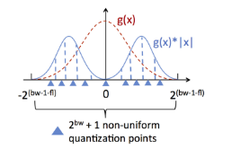
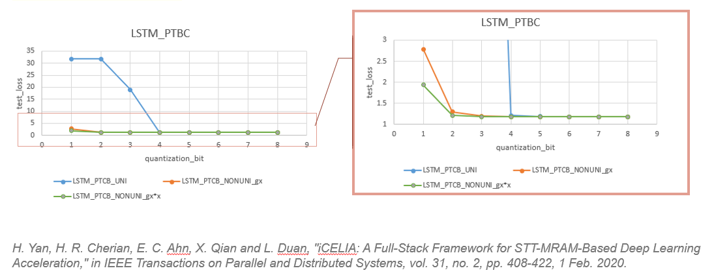
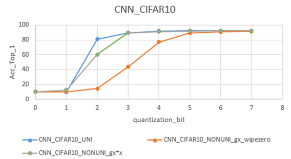

[TOC]

## 快速跳转：

[20200407](#4.1)

## 20200407

### 1. Papers

#### 1.1 Hardware Accelerator for Adversarial Attacks on Deep Learning Neural Networks

* **Info:**
  Alibaba Group：Computing Technology Lab
  
  Haoqiang Guo, Lide Duan
  
* **Related domain：**

  * Adversarial Attacks on Deep Learning Neural Networks（Typical:  AttackNet)
  
  * Neural Network Acceleration in Crossbar
  
* **Proposed methods：**

  **Baseline**: Pipelayer (the only processing-in-memory (PIM) platform supporting CNN training)

  **Proposed $A^3$：**

  * $A^3$ explores buffer optimization due to the uniqueness of AttackNet algorithms.  AttackNet does not require the same amount of on-chip buffers as what CNN training does. The back propagation process of AttackNet only involves error propagation without updating weights, which can relieve the neuron storage requirement.
* $A^3$ uses a single crossbar to store weight values, nearly doubling the utilization of crossbars. Furthermore, we redesign the Shift&Add units and Max pooling units to support the modification.
  

**My view**：

  * The article did no much amazing innovation but finished a work others haven't done.

#### 1.2 iCELIA: A Full-Stack Framework for STT-MRAM-Based Deep Learning Acceleration

* **Info:**
  Alibaba Group：Computing Technology Lab

  Haoqiang Guo, Lide Duan

* **Related domain：**
  * NVM(新型非易失型存储):
    * PCM
    * MRAM-------**STT-MRAM**(自旋磁阻式内存)
    * RRAM

  * STT-MRAM for NN Computation：
    * Benefits：
      1. STT-MRAM has longer cell lifetime   
      2. STT-MRAM is able to induce complex and tunable resistance dynamics through the mechanism of spin transfer torque

* **Challenges and solutions**:

  > Challenge 1 : NVM-based NN programs weights into NVM cell conductance (resistance),  the limited number of resistance states in NVM cell largely reduce data precision. Since smaller ON/OFF resistance ratio, STT-MRAM suffers more from the problem.

  Solution 1 ：it is possible to obtain different resistance values at the AP state by controlling the voltage sweep and its cycling history. 

  

  

  > Challenge 2 :How the limited cell resistance states are used to represent the original NN model

  Solution 2.1 ：32 bit float ——>fixed-point number representation

  Solution 2.2 ：Two non-uniform data quantization schemes

  | Importance Functions                                      | K-Mean Clustering                                         |
  | --------------------------------------------------------- | --------------------------------------------------------- |
  |  |  |

  

#### 1.3 Rethinking floating point for deep learning

* **Info:**

  -- Jeff Johnson
  -- Facebook AI Research

### 2. Work

#### 2.1 Comparison between CC and proposed  FM_CC:

 

#### 2.2 Reproduce the **Importance Functions** quantization solution on LSTM and CNN.

* **LSTM: Success**

  

* **CNN: fail**

  

#### 2.3 Convert a pre-trained pytorch model with 32 bit float to 8 bit DFP (stilling working on it)

....

### 3. Work

* Convert a pre-trained pytorch model with 32 bit float weight presentation to 8 bit DFP (stilling working on it)