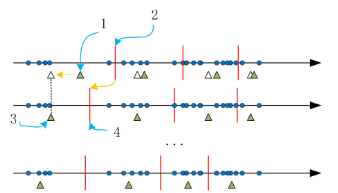
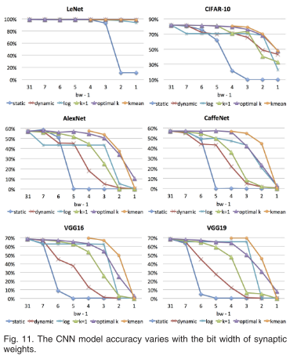
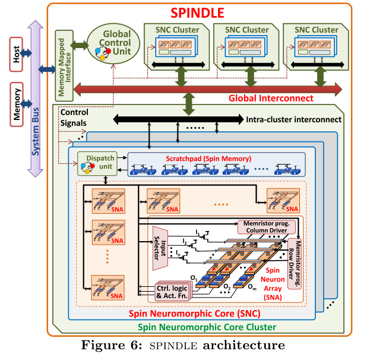
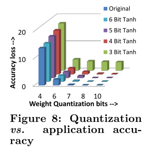
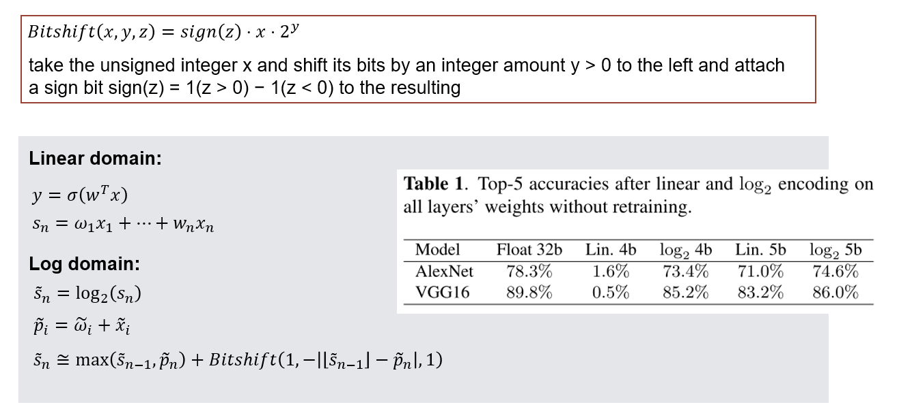
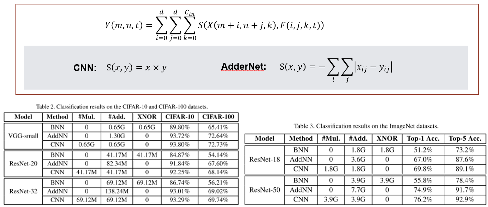

[TOC]

## 快速跳转：

[20200407](#4.1)

[20200414](#4.2)

## 20200407

### 1. Papers

#### 1.1 Hardware Accelerator for Adversarial Attacks on Deep Learning Neural Networks

* **Info:**
  Alibaba Group：Computing Technology Lab
  
  Haoqiang Guo, Lide Duan
  
* **Related domain：**

  * Adversarial Attacks on Deep Learning Neural Networks（Typical:  AttackNet)
  
  * Neural Network Acceleration in Crossbar
  
* **Proposed methods：**

  **Baseline**: Pipelayer (the only processing-in-memory (PIM) platform supporting CNN training)

  **Proposed $A^3$：**

  * $A^3$ explores buffer optimization due to the uniqueness of AttackNet algorithms.  AttackNet does not require the same amount of on-chip buffers as what CNN training does. The back propagation process of AttackNet only involves error propagation without updating weights, which can relieve the neuron storage requirement.
  
    
* $A^3$ uses a single crossbar to store weight values, nearly doubling the utilization of crossbars. Furthermore, we redesign the Shift&Add units and Max pooling units to support the modification.
  

**My view**：

  * The article did no much amazing innovation but finished a work others haven't done.

#### 1.2 iCELIA: A Full-Stack Framework for STT-MRAM-Based Deep Learning Acceleration

* **Info:**
  Alibaba Group：Computing Technology Lab

  Haoqiang Guo, Lide Duan

* **Related domain：**
  * NVM(新型非易失型存储):
    * PCM
    * MRAM-------**STT-MRAM**(自旋磁阻式内存)
    * RRAM

  * STT-MRAM for NN Computation：
    * Benefits：
      1. STT-MRAM has longer cell lifetime   
      2. STT-MRAM is able to induce complex and tunable resistance dynamics through the mechanism of spin transfer torque

* **Challenges and solutions**:

  > Challenge 1 : NVM-based NN programs weights into NVM cell conductance (resistance),  the limited number of resistance states in NVM cell largely reduce data precision. Since smaller ON/OFF resistance ratio, STT-MRAM suffers more from the problem.

  Solution 1 ：it is possible to obtain different resistance values at the AP state by controlling the voltage sweep and its cycling history. 

  

  

  > Challenge 2 :How the limited cell resistance states are used to represent the original NN model

  Solution 2.1 ：32 bit float ——>fixed-point number representation

  Solution 2.2 ：Two non-uniform data quantization schemes

  | Importance Functions                                      | K-Mean Clustering                                         |
  | --------------------------------------------------------- | --------------------------------------------------------- |
  |  |  |

  

#### 1.3 Rethinking floating point for deep learning

* **Info:**

  -- Jeff Johnson
  -- Facebook AI Research

### 2. Work

#### 2.1 Comparison between CC and proposed  FM_CC:

 

#### 2.2 Reproduce the **Importance Functions** quantization solution on LSTM and CNN.

* **LSTM: Success**

  

* **CNN: fail**

  

#### 2.3 Convert a pre-trained pytorch model with 32 bit float to 8 bit DFP (stilling working on it)

....

### 3. Plan

* Convert a pre-trained pytorch model with 32 bit float weight presentation to 8 bit DFP (stilling working on it)

## 20200414

### 1. Papers

#### 1.1 Rethinking floating point for deep learning

Facebook 18年的一篇文章，好像未发表，完全看懂需要了解很多细节，可以当做科普文来看。

* **Space-efficient encodings**

  **Posit** fomat is more space efficient than **IEEE 754-style fixed width field encodings**

* **Accumulator efficiency and precision **

  >**单精度浮点数**：
  >
  >
  >
  > $$ f = (-1)^{Sign}*1.Mantissa*2^{Exponent} $$

  **普通计算$x*y+z$的方法 **：Double rounding

     e=3; s=4.734612

  × e=5; s=5.417242

  \-----------------------

     e=8; s=25.648538980104 (true product)

     e=8; s=25.64854 (after rounding)

     e=9; s=2.564854 (after normalization)

  在normalization之后，再去加z，得到的结果再进行一次rounding和normalization。

  **FMA的计算方式**：Single rounding

  直接用true product和z相加，得到的结果进行一次rounding和normalization就得到最终的结果了。

  **EMA的计算方式**：

  对于$\sum{a_ib_i}$，累加计算完成之后再进行rounding

* **Multiplier efficiency**

  虽然有EMA，但是乘法运算还是效率不高

  **logarithmic number system (LNS)**：考虑在log域中进行计算，避免乘法

  Assuming：$i=log_2(x),j=log_2(y)$

  Then：

  $log_2(xy) = i + j$

  $log_2(x/y) = i - j$

  $log_2(x\pm y) = i + \sigma_{\pm}(j-i)$

  乘除法运算，精确；但是加减法运算中**$\sigma_{\pm}(j-i)$通过近似估计得到，不准确**

  **exact log-linear multiply-add(ELMA): **（本文提出）

  log域中做加减法，linear域中做乘除法

  误差来源与log域和linear域中数值转换的误差。

  实验证明，4bits之下效果（更少的位宽表示，更高的网络精度）更好

#### 1.2 SPINDLE: SPINtronic Deep Learning Engine for Large-scale Neuromorphic Computing

自旋电子，看这篇论文主要是想了解其中的tanh()非均匀量化方法，看完感觉有中被骗了的感觉。

1. SNC作为一个计算阵列，SNA作为计算单元，直接输出激活函数结果。
2. 需要量化的第一个是Spin memory，用来存储输入输出，因为写入成本比较大，所以需要激活函数的输出的低比特量化。
3. 需要量化的第二个是Spin Neuron Array中，因为是通过resistive crossbar array存储权重，权重位宽越大，需要的电阻值随着指数增加，所以需要权重量化。

​	通过实验选择了3bit tanh()量化和8bit权重量化。tanh()量化原理如下，实际上就是一个分段函数，硬件中通过LUT实现。

#### 1.3 LOGNET: ENERGY-EFFICIENT NEURAL NETWORKS USING LOGARITHMIC COMPUTATION

#### 1.4 AdderNet: Do We Really Need Multiplications in Deep Learning?

### 2. Work

* python中做自定义数据格式的量化有点头大，已放弃

## 20200421

### 1. Papers

* GraphQ: Scalable PIM-Based Graph Processing
* Performance Impact of Emerging Memory Technologies on Big Data Applications: A Latency-Programmable System Emulation Approach

### 2. Works and Plans

* Paper：revising（~2 weeks）

* DLA register configuration-----LSTM Partition (This week)

