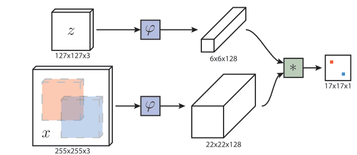
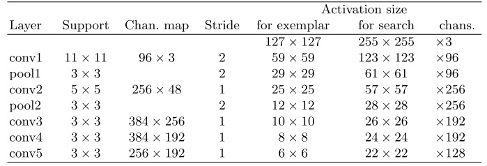

# 20191031

## paper summary：

论文题目：Fully-Convolutional Siamese Networks for Object Tracking

论文链接：  https://arxiv.org/pdf/1606.09549.pdf 

### 一、该论文拟解决的问题

传统的跟踪算法大多从物体的外观出发，只能在线学习，从当前的视频中在线抓取数据进行学习跟踪的算法。尽管这些方法取得了成功，但仅在线方法固有地限制了他们可以学习的模型的丰富性。在孪生网络出现之前也有人使用卷积网络进行离线训练，但是当跟踪目标未知时，需要利用随机梯度下降法(SGD)在线微调网络权重，从而使得速度下降，做不到实时跟踪。 在本篇论文中，作者提出了一个端到端训练的新型全卷积孪生网络，用于视频中的目标检测。 这个跟踪器以超出实时的帧速率运行，尽管极其简单，但在多个benchmark测试中仍可实现最先进的性能。

### 二、方法

**网络结构：**

- z 表示样本图像（即目标）
- x 表示待搜索图像 

**全卷积网络**：
$$
f(z,x)=φ(z)∗φ(x)+b1
$$

- b1 表示在得分图中每个位置的取值

- 上式可将 φ(z) 看成卷积核，在 φ(x)上进行卷积，两个函数是一样的（权值共享是孪生网络的特点）

- 该嵌入特征提取网络层采用的是AlexNet如下：

  

最后 网络生成的是17×17 的score map，而输入x是255×255的搜索图像 ，作者将17×17的score map进行双三次插值生成272×272的图像，来确定物体的位置。但是为什么不生成255×255的图像呢，作者在论文中说，这样做是由于原始图像相对比较粗糙，为了使定位更加准确。 

**模型输入：**

孪生网络有两个分支对应两个输入，z与x的大小并不是任意输入的，采用127×127 的模板图像和 255×255 像素的搜索图像。如下图所示 ：

​		上面的三张图是网络输入的模板图像z，下面对应的是网络输入的搜索图像x，红色为当前的所在帧的bounding-box。当模板图像和搜索图像不够裁剪时，会对不足的像素按照RGB通道的均值进行填充，如果边界框具有大小（w，h），并且上下文边界为p，其中A是常量为127*127，s是选择比列因子，则会通过以下公式生成模板图像的大小： 
$$
s(w+2p)×s(h+2p)=A
$$

$$
设置为平均尺寸p=\frac{w+h}{4}的一半
$$

**训练**：

作者采用了Logistic损失函数，该式表示的正样本的概率为（1）（sigmoid函数），按交叉熵的公式得到如下的损失函数的公式（2）
$$
\frac{1}{1+e^{-v}}
​​​​
（1）
$$

$$
ℓ(y,v)=log(1+exp(−yv))
​​​​​​​（2）
$$

训练时采用所有候选位置的平均loss来表示，公式如下： 

网络输出正负样本y的确定：在输入搜索图像上（如255*255），只要和目标的距离不超过R，那就算正样本，否则就是负样本，用公式表示如下：

​				 *v* 表示样本–搜索图像的实际得分 

​				 D 表示最后得到的 score map 

​				 *u* 表示 score map 中的所有位置 

​				 *k* 为网络的总步长 

​				 *c* 为目标的中心 

 	 	 	  R 为定义的半径 

训练的卷积参数 θ 通过SGD来最小化得到：

### 三、思考&总结

- 现在很多的目标跟踪都是基于这个网络思路往下发展的，下面再去进一步的阅读目标跟踪的一些经典论文。
- 了解一下图像输入的时候怎样将不同的尺寸的图像进行统一的
