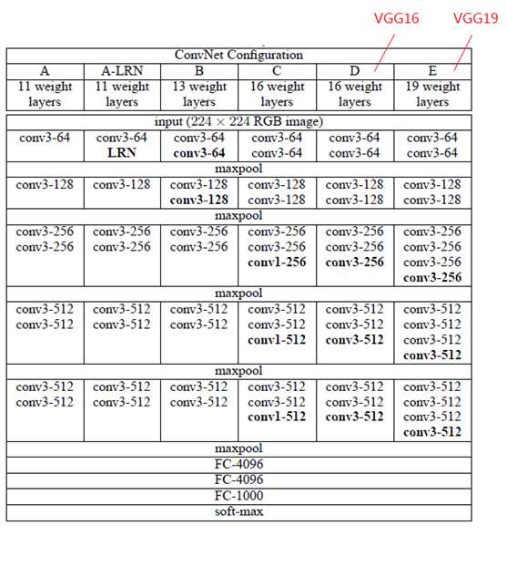

# 20191023

## paper summary：

论文题目：very Deep Convolutional Networks for Large-Scale Image Recognition

论文链接：https://arxiv.org/abs/1409.1556 

### 一、该论文拟解决的问题

本论文是在大规模图像分类的背景下，主要研究了卷积网络深度对大规模图像分类正确率的影响 

### 二、方法

 VGG在结构上与AlexNet类似，VGG  全部使用很小的3x3、步长为1的卷积核代替AlexNet 第一层使用的是11x11、步长为4的卷积核来扫描输入，在每几次卷积后（一般为2，也有3次的）都进行一次Max pooling（均为2x2），一方面可以减少参数，另一方面相当于进行了更多的非线性映射，可以增加网络的拟合/表达能力。 一个 11x11的卷积核可以用三个3x3卷积核代替进行堆叠。 作者固定了网络中其他的参数，通过缓慢的增加网络的深度来探索网络的效果。 

VGG结构图：

ConvNet Configuration：

### 三、思考

本论文讨论了卷积层深度对大规模图片分类效果的影响，那有没有研究者探索过网络深度和卷积核的大小是怎样的一个关系会使分类效果更好？以及步长对分类效果的影响？
