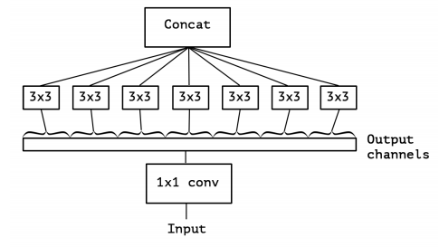
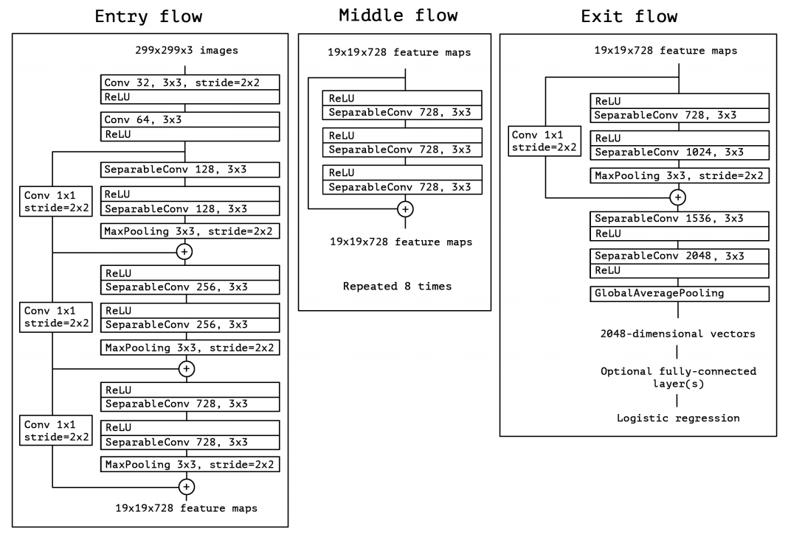

# 20191021

## paper summary：

论文题目：Xception: Deep Learning with Depthwise Separable Convolutions

论文链接：https://arxiv.org/abs/1610.02357

### 一、该论文拟解决的问题：

该模型是基于Inception V3假设的基础上提出来的， Inception 背后的基础假设是：将通道间关系和空间关系完全解耦， 从而使得这个过程更简单、高效。 这样做的目的是在面对很大的数据集时，能提高Inception V3的性能。因为  Xception 架构与 Inception v3 的参数量是相同，因此性能的提高不是由于模型容量的增加，而是由于模型参数更高效的利用。 

### 二、方法：

 **depthwise separable convolution**：等价于一个 depthwise 卷积 + 一个 pointwise 卷积 

1、深度可分离卷积先进行 channel-wise 的空间卷积，再进行1×1 的通道卷积，Inception则相反；
2、Inception中，第一个操作后会有一个ReLU的非线性激活，而深度可分离卷积则没有。

从常规卷积 -> 典型的Inception -> 简化的Inception -> “极限”Inception，实际上是输入通道分组的一个变化过程。常规卷积可看做将输入通道当做整体，不做任何分割；Inception则将通道分割成3至4份，进行3×3的卷积操作；“极限”Inception则每一个通道都对应一个3×3的卷积。这样每个通道可以完全独立，将通道间关系和空间关系完全解耦

引入深度可分离卷积的 Inception，即Xception（Extreme Inception），其结构图如下。Xception 架构共使用了 36 个 depthwise separable 卷积来提取来构成基本的特征提取器。36 个卷积层被拆分成 14 个模块，所有的模块都使用残差连接（除了第一个和最后一个模块） 

### 三、思考

看了这篇论文需要亟须去学习一些基本算法和框架的知识，如：AlexNet、VGG架构等，在看这篇论文通时也看了Inception V1/V2/V3的基本原理。
