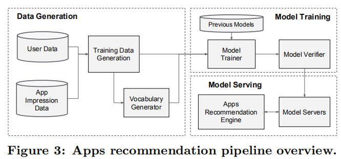
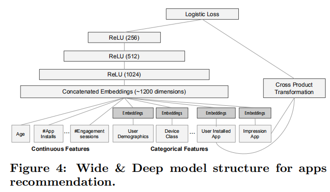

论文题目：Wide & Deep Learning for Recommender Systems

论文链接：https://arxiv.org/pdf/1606.07792.pdf

summary：

一、该论文拟解决的问题：

Wide模型具有高度拟合性，但泛化能力差，Deep模型具有很好的泛化性，但拟合度欠缺。运用wide&deep learning训练获得的模型能够同时获得记忆（memorization）和泛化（generalization）能力，将这两个优势结合了一下：

1、记忆（memorization）即从历史数据中发现item或者特征之间的相关性（Wide模型具有的优势）。

2、泛化（generalization）即相关性的传递，发现在历史数据中很少或者没有出现的新的特征组合（Deep模型具有的优势）。（个人理解类似于学习、推理能力）

二、方法：

系统概述：

该系统相当于一个排名系统，其中输入信息是一组用户数据（User Data）和上下文信息（App Impression Data），输出是一个排了顺序的商品列表。即给定一个查询语句，推荐任务是在数据库中查询相关的商品，然后基于某些目标（例如点击或者购买）对商品排名。

该系统有三个阶段：数据生成，模型训练，模型服务。Wide & Deep模型核心的地方在于模型训练。

模型训练：

模型的预测：

其中，Y是二值分类标签，σ是sigmoid函数，φ(x)是交叉积特征变换，b是偏置项  是Wwide是wide模型的权重，Wdeep 是用于最终激活函数a(lf)的权重。

训练过程中，输入层接收训练数据和词汇表，同时生成带label的稀疏和稠密的特征。wide部分包括用户安装的app和展示的app的交叉积特征变换。deep部分，为每个分类特征学习学习32维的嵌入向量。我们将所有向量和稠密特征连接成一个约1200维的稠密向量。然后将连接的矢量输入3个ReLU层，最后输入逻辑输出单元。

本文将wide&deep模型应用在了谷歌市场的app推荐中，之后用该模型与仅用wide模型和仅用deep模型的推荐系统进行比比较，然后比较实验中两个指标：一是他们推荐系统下的APP购买的次数。二是服务性能（即产生排名的时间），结果表明，采用wide&deep模型的两个指标要好于其他两种

三、思考

*在看本论文的困惑：

1、 没有详细的介绍该算法是怎么实现的一些细节（但是论文中说tensorflow中开源了代码）

2、 其中这个购买量的数据是否可靠？比如时间（季节性等等），外界的因素（比如某些APP购买量可能是这一阶段广告推广）

*看了本篇论文仿佛在看考研的阅读理解，很多长难句拆分

*对于优劣方面啥的话，现在我觉得的应该的是见多识广，后面需要多看论文，才能有更好更多的见解

