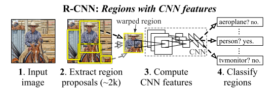
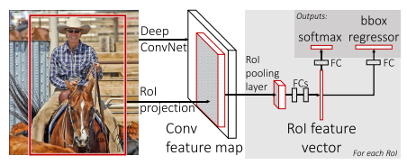
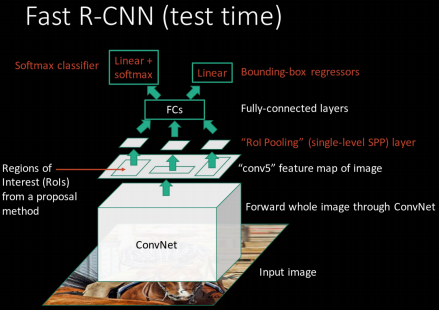
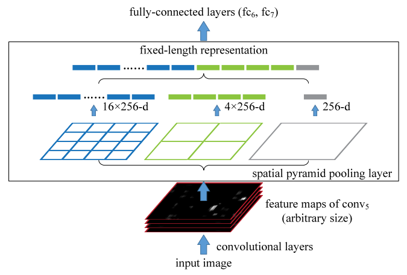
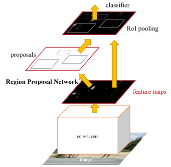
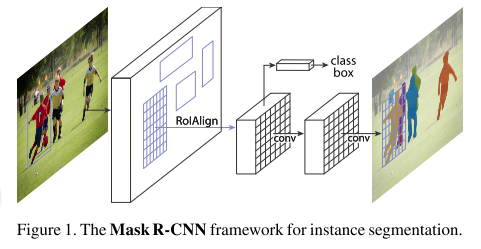

# 20191107-20191121

## paper reading

**R-CNN-2014**

论文题目：Rich feature hierarchies for accurate object detection and semantic segmentation

论文链接： https://arxiv.org/pdf/1311.2524.pdf 

**Fast R-CNN-2015**

论文题目： Fast R-CNN 

论文链接： https://arxiv.org/pdf/1504.08083.pdf 

**Faster R-CNN-2017**

论文题目：  Faster R-CNN: Towards Real-Time Object Detection with Region Proposal Networks 

论文链接： https://arxiv.org/pdf/1506.01497.pdf 

**Mask R-CNN-2018**

论文题目：  Mask R-CNN

论文链接： https://arxiv.org/pdf/1703.06870.pdf 

## RCNN

大致的过程可分为下面four steps：

​	1.获取输入图像

​	2.提取约2000个候选区域（selective search方法）

​	3.将候选区域（所有候选区域均warp成227×227 pixel size）分别输入CNN网络（这里需要将候选图片进行缩放）

​	4.将CNN输出的feature maps输入SVM中进行类别的判定 和进行Bounding Box的回归

#### 【补充：selective search】

#### **方法：**

许多候选框（约为两千个）-->CNN-->得到每个候选框的特征-->分类+回归 

**缺点：**

使用了selective search等预处理步骤来提取潜在的bounding box（约为2000）作为输入，但是RCNN仍会有严重的速度瓶颈，原因也很明显，就是计算机对所有region进行特征提取时会有重复计算 

## Fast RCNN

Fast RCNN=SPP Net+RCNN

#### **拟解决的问题：**

RCNN由于每一个候选框都要独自经过CNN，这使得花费的时间非常多。Fast RCNN主要解决了RCNN中每个Bounding Box重复计算的问题， 共享卷积层，现在不是每一个候选框都当做输入进入CNN了，而是输入一张完整的图片，在第五个卷积层再得到每个候选框的特征 

#### **方法：**

大致的过程steps：

​	1. 在图像中确定约1000-2000个候选框 (使用选择性搜索)

​	2. 对整张图片输进CNN，得到feature map

​	3. 找到每个候选框在feature map上的映射patch，将此patch作为每个候选框的卷积特征输入到SPP layer和之后的层

​	4. 对候选框中提取出的特征，使用分类器判别是否属于一个特定类

​	5. 对于属于某一特征的候选框，用回归器进一步调整其位置 

 一张完整图片-->CNN-->得到每张候选框的特征-->分类+回归 

作者提出了一个可以看做单层SPP Net的网络层，叫做ROI Pooling，这个网络层可以把不同大小的输入映射到一个固定尺度的特征向量，而我们知道，conv、pooling、relu等操作都不需要固定size的输入，因此，在原始图片上执行这些操作后，虽然输入图片size不同导致得到的feature map尺寸也不同，不能直接接到一个全连接层进行分类，但是可以加入这个ROI Pooling层，对每个region都提取一个固定维度的特征表示，再通过正常的softmax进行类型识别。另外，之前RCNN的处理流程是先提proposal，然后CNN提取特征，之后用SVM分类器，最后再做bbox regression，而在Fast-RCNN中，作者巧妙的把bbox regression放进了神经网络内部，与region分类和并成为了一个multi-task模型，实际实验也证明，这两个任务能够共享卷积特征，并相互促进。

**RCNN vs Fast RCNN结果：**

## Faster RCNN

Faster RCNN=FPN+RPN+Fast RCNN

#### 拟解决的问题:

 Fast R-CNN存在的问题：选择性搜索，找出所有的候选框，这个非常耗时。

#### 方法：

大致的过程steps：

​	1. 对整张图片输进CNN，得到feature map

​	2. 卷积特征输入到RPN（全卷积层），得到候选框的特征信息

​	3. 对候选框中提取出的特征，使用分类器判别是否属于一个特定类

​	4. 对于属于某一特征的候选框，用回归器进一步调整其位置 

更为详细的网络的结构：

通过上面两张图可以看出Faster R-CNN由四个部分组成：

​	1.卷积层(conv layers)，用于提取图片的特征，输入为整张图片，输出为提取出的特征称为feature maps

​	2.RPN网络(Region Proposal Network)，用于推荐候选区域，这个网络是用来代替之前的search selective的。输入为图片(因为这里RPN网络和Fast R-CNN共用同一个CNN，所以这里输入也可以认为是featrue maps)，输出为多个候选区域.。

​	3.RoI pooling，和Fast R-CNN一样，将不同大小的输入转换为固定长度的输出，输入输出和Faste R-CNN中RoI pooling一样。

​	4.分类和回归，这一层的输出是最终目的，输出候选区域所属的类，和候选区域在图像中的精确位置。

**RCNN vs Fast RCNN vs Faster RCNN结果：**

 结构越来越精简，精度越来越高，速度也越来越快 

## Mask RCNN

Mask RCNN=FPN+RPN+Fast RCNN+Mask=Faster RCNN+Mask

在Faster RCNN上面增加了一个Mask分支-实例分割架构，可用于人的姿态估计等其他任务 

论文中的大体架构：

详细的Mask RCNN架构

Mask R-CNN算法步骤：

1. 输入一幅你想处理的图片，然后进行对应的预处理操作，或者预处理后的图片；
2. 将其输入到一个预训练好的神经网络中（ResNeXt等）获得对应的feature map；
3. 对这个feature map中的每一点设定预定个的ROI，从而获得多个候选ROI；
4. 将这些候选的ROI送入RPN网络进行二值分类（前景或背景）和BB回归，过滤掉一部分候选的ROI；
5. 对这些剩下的ROI进行ROIAlign操作（即先将原图和feature map的pixel对应起来，然后将feature map和固定的feature对应起来）；

未完，待续……………………

## work

- 把上面的几篇论文基本看了一下
- 两个课程的pre

## plan

- 把Mask论文一点的尾巴结束+SiamMask论文
- 课程作业

