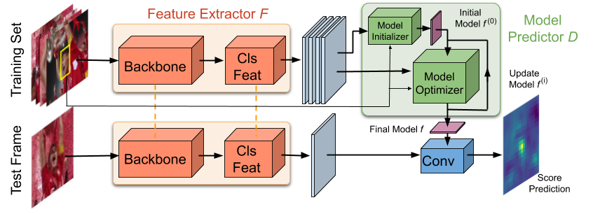

# DiMP. Learning Discriminative Model Prediction for Tracking 

DiMP is an end-to-end tracking architecture, capable of fully exploiting both target and background appearance information for target model prediction. It is based on a target model  prediction network, which is derived from a discriminative learning loss by applying an iterative optimization procedure. The model prediction network employs a steepest descent based methodology that computes an optimal step length in each iteration to provide fast convergence. The model predictor also includes an initializer network that efficiently provides an initial estimate of the model weights.

# ATOM: Accurate Tracking by Overlap Maximization

ATOM is based on (i) a **target estimation** module that is trained offline, and (ii) **target classification** module that is trained online. The target estimation module is trained to predict the intersection-over-union (IoU) overlap between the target and a bounding box estimate. The target classification module is learned online using dedicated optimization techniques to discriminate between the target object and background.