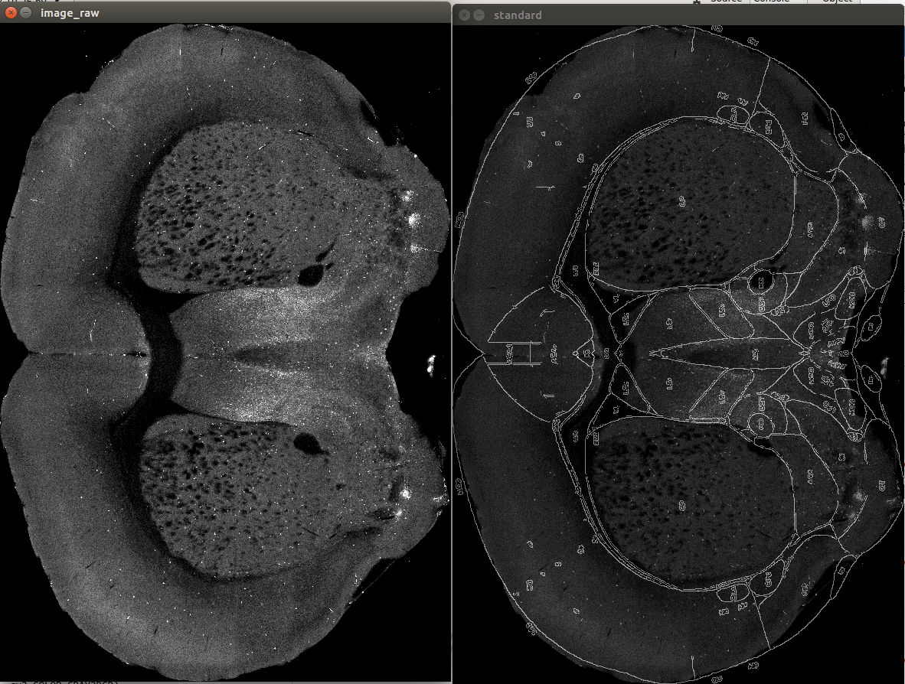
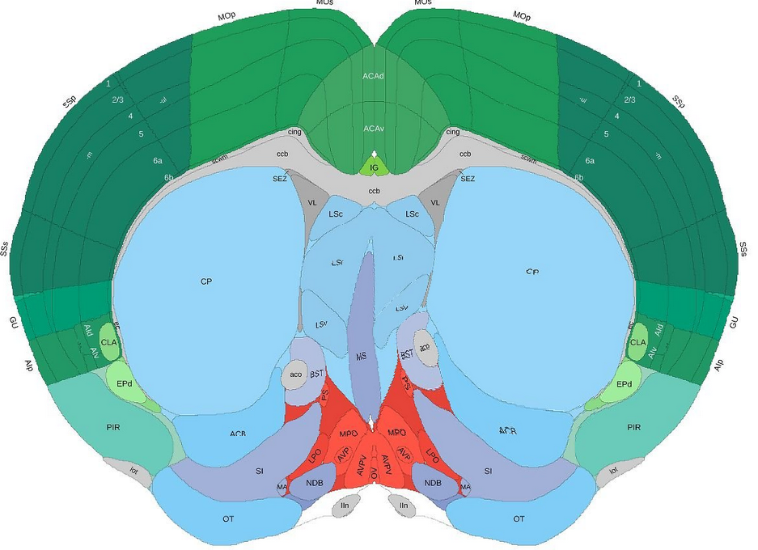

# 自动分区算法实现

1. 沿轮廓上下左右四个方向最外围的点作切线，将整个脑轮廓内的图片crop出来，去除边缘空白区域。
2. 鼠脑切片和标准脑图谱均应用做此操作，并且把标准图谱resize成和鼠脑切片同一大小，得到下图。（此步骤存在图像分辨率和插值问题，后续优化）
3. 对标准脑图片使用canny算子提取边缘，再与鼠脑切片进行图片融合，可以看到轮廓大致能够对应。但部分区域无法对应，比如鼠脑中间下部的黑点区域，与图谱中该区域错位。

1. 局部变形算法

   拟使用网格划分的算法进行。

   将整幅图片划分成数十个网格，拖动目标点处在某个网格内，就对某个网格做拖拽，附近网格对应进行细微调整，离目标点网格越近，调整程度越大。基于PIL库中transform方法的MESH实现。

   可实现类似下图效果（中部区域微调）。基于网格的变形算法正在进行代码编写和针对性优化。

# 其他优化

由使用最外围轮廓改为使用最外围轮廓的凸包，更平滑。

## 各种插值算法（和变形微调效果有关）

> http://blog.sina.com.cn/s/blog_627956c90100xu3p.html

1. IDW。

基本思想是目标离观察点越近则权重越大，受该观察点的影响越大。好处是观察点本身是绝对准确的，而且可以限制插值点的个数。通过power可以确定最近原则对于结果影响的程度。Search radius可以控制插值点的个数。

1. 克里金插值。

克里金插值与IDW插值的区别在于权重的选择，IDW仅仅将距离的倒数作为权重，而克里金考虑到了空间相关性的问题。它首先将每两个点进行配对，这样就能产生一个自变量为两点之间距离的函数。对于这种方法，原始的输入点可能会发生变化。在数据点多时，结果更加可靠。

1. Natural Neighbour法

原理是构建voronoi多边形，也就是泰森多边形。首先将所有的空间点构建成voronoi多边形，然后将待求点也构建一个voronoi多边形，这样就与圆多边形有很多相交的地方，根据每一块的面积按比例设置权重，这样就能够求得待求点的值了。个人感觉这种空间插值方法没有实际的意义来支持。

1. 样条函数插值spline

这种方法使用样条函数来对空间点进行插值，它有两个基本条件：1.表面必须完全通过样本点2.表面的二阶曲率是最小的。一下是一篇论文里spline与IDW之间的比较：

从本文实验数据可以看出，IDW 插值主要受幂指数和各采样点属性值变化情况的影响，幂指数越高，其局部影响的程度越高，在IDW搜索半径内，若各个采样点属性值变化较小时，内插结果受幂指数的影响较小；Spline 插值主要受插值类型（Regularized 或Tension）和weight 值的影响，一般Regularize 插值结果比Tension插值结果光滑，在Regularized Spline 插值中，weight 值越高生成的表面越光滑，Tension Spline 插值则相反；总体来看，IDW和SPLINE 插值受采样点范围、采样点密度、采样点属性取值变化以及各自的参数影响，当采样点足够密时，使用IDW插值可以取得良好效果，SPLINE插值则适合那些空间连续变化且光滑的表面的生成。

1. Topo to Raster

这种方法是用于各种矢量数据的，特别是可以处理等高线数据

1. Trend

这种方法是用多项式拟合，虽然它不一定在局部很符合输入点，但是在总体上是非常符合的。由Polynominal order来确定多项式的级数，1表示平面，最高是12，这是最复杂的情况。

