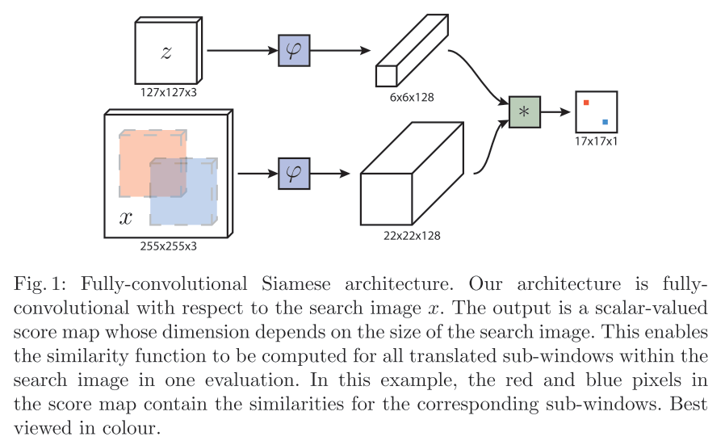
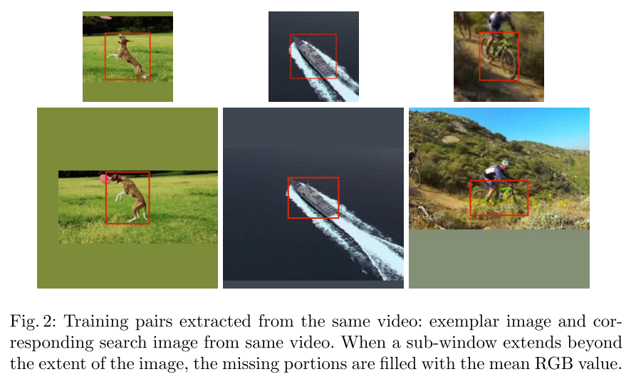
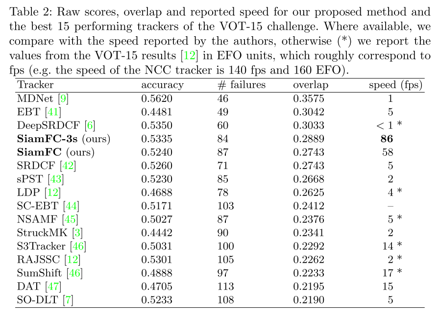

# SiamFC

> Bertinetto, L., Valmadre, J., Henriques, J. F., Vedaldi, A., & Torr, P. H. S. (2016). Fully-Convolutional Siamese Networks for Object Tracking. *Lecture Notes in Computer Science (Including Subseries Lecture Notes in Artificial Intelligence and Lecture Notes in Bioinformatics)*, *9914 LNCS*, 850–865. https://doi.org/10.1007/978-3-319-48881-3_56

## 1 简介

​	在跟踪任务中，需要跟踪的目标是通过起始帧的选择框给出的。框中可能是任意物体，甚至只是物体的某个部分。由于给定跟踪目标的不确定性，我们无法做到提前准备好数据，并且训练出一个具体的（specific）detector。过去几年出现了TLD，Struck和KCF等优秀的算法，但由于上述原因，用于跟踪的模型往往是一个简单模型，通过在线训练，来进行下一帧的更新。

​	本文提出了一种基于相似度学习（similarity learning）的跟踪器SiamFC，通过进行离线训练，线上的跟踪过程只需预测即可。这使得SiamFC在性能可观的同时，还达到了超过实时的帧率（58 fps & 86 fps @ VOT-15）。

​	同时作者还使用了ILSVRC目标检测数据集来进行相似度学习的训练，验证了该数据集训练得到的模型在ALOV/OTB/VOT等跟踪数据集中拥有较好泛化能力。

## 2 相似度学习

​	SiamFC通过使用相似度学习的方法来解决追踪任意目标的问题。

​	使用函数$f(z,x)$来比较模板图像z域候选图像x的相似度，相似度越高，则得分越高。为了找到在下一帧图像中目标的位置，我们测试所有所有目标可能出现的位置，将相似度最大的位置作为目标的预测位置。而函数f是通过视频数据集中给定的物体运动轨迹进行训练得到的。

​	本文使用深度卷积网络来作为函数f，使用Siamese网络的结构，如下图。

​	Siamese网络使用同一个变换函数$varphi$来对两个输入进行处理，之后将得到的特征使用函数g进行混合。
$$
f(z,x)=g(\varphi(z),\varphi(x))
$$
​	当函数g为简单的几何距离或相似度矩阵时，函数$varphi$就可以理解为一种嵌入（embedding），类似于NLP中的词嵌入，简单来说就是一种提取特征的词典。Siamese网络过去被用于人脸识别，关键点识别，one-shot字符识别等任务中。

​	更进一步地，本文提出了一种全卷积的Siamese网络，称为SiamFC。全卷积的结构可以直接将模板图像与大块的候选区域进行匹配，全卷积网络最后的输出就为我们需要的响应图。在响应图中寻找响应值最高的一点，该点在候选区域中的对应部分，就是预测的目标位置。也可以用感受野来理解，上图中输出的小红点和小蓝点，对应在输入层的感受野就是输入图像x中的红色区域和蓝色区域。

​	整个网络的核心架构就是这样，还有一些细节，比如在训练时，如果候选框超出了图像区域，本文会使用图像的平均像素来进行Padding，如下图。

## 3 结论

​	SiamFC在使用深度学习方法的跟踪器中，很难得的达到了超实时的高帧率，甩开在此之前的网络几条大街。后来的基于深度学习放大的跟踪器也多数在follow此方法，进行改良性创新。所以此篇论文颇具里程碑意义，值得一读。