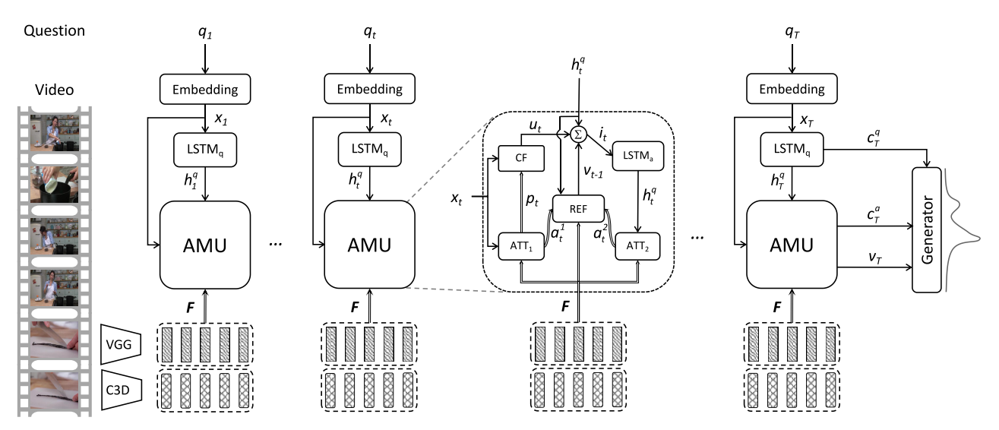
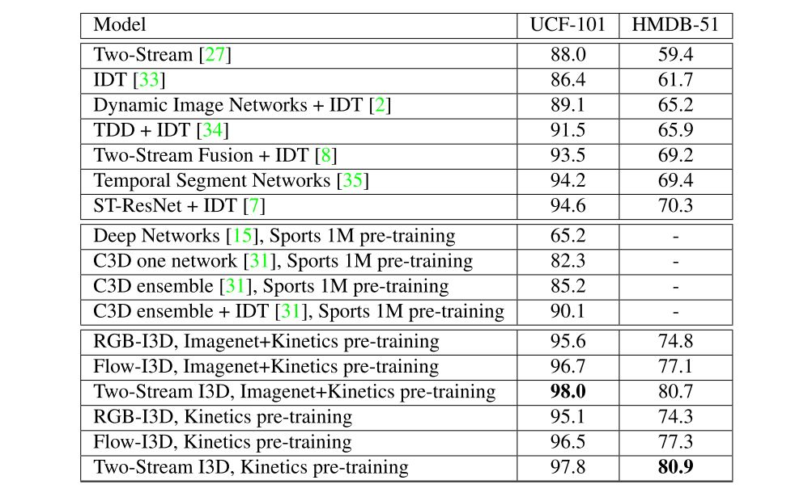
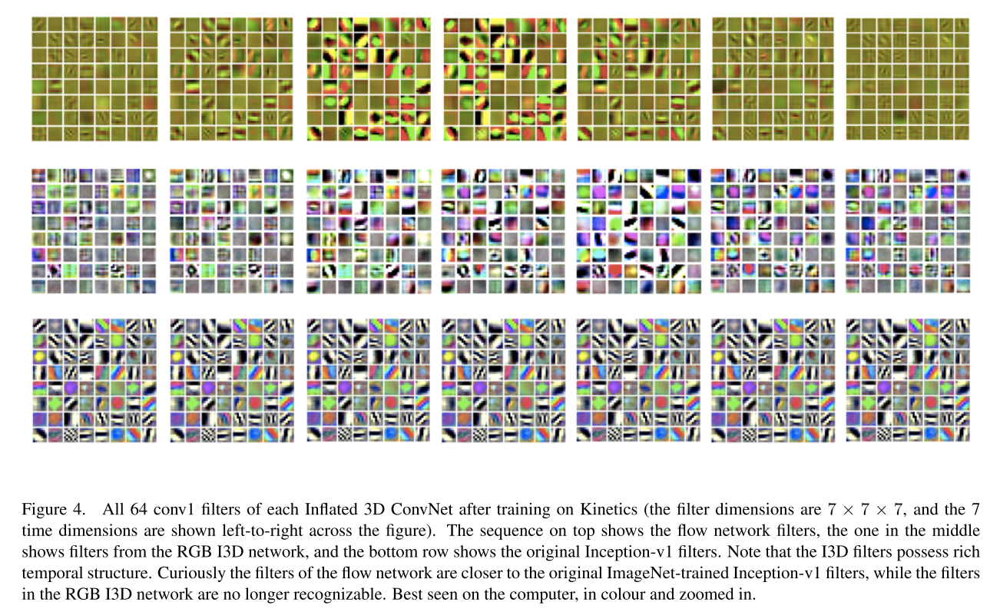
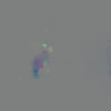
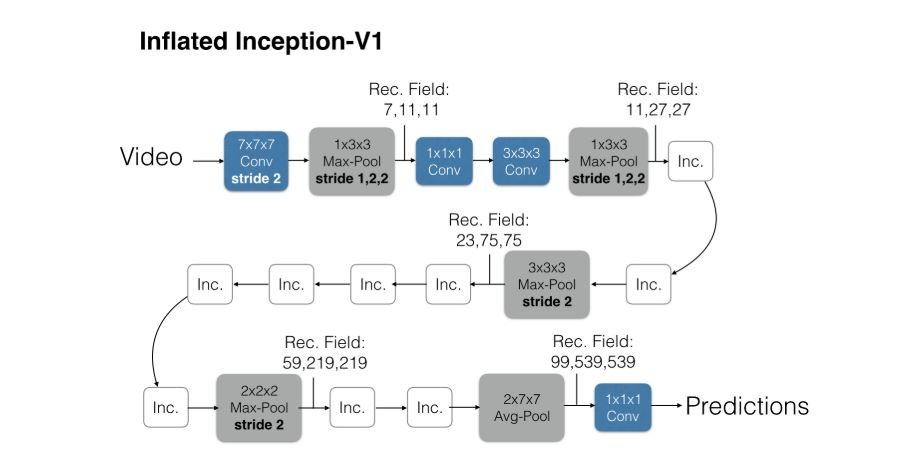

# VideoQA



1. **C3D**  

   C3D之后诞生的视频处理网络有I3D、P3D、non-local NET等。

   > I3D:Quo Vadis, Action Recognition? A New Model and the Kinetics Dataset,CVPR 2017
   >
   > P3D:
   >
   > non-local NET:Non-local Neural Networks,CVPR 2018
   >
   > 动作识别调研：https://www.cnblogs.com/nowgood/p/actionrecognition.html

2. **VGG**

   替换为识别准确率更高的图片分类模型。

3. **AMU**

&nbsp;

## 1  I3D

> Quo Vadis, Action Recognition? A New Model and the Kinetics Dataset,CVPR 2017
>
> tensorflow源码：https://github.com/deepmind/kinetics-i3d

### 1.1  论文理解


*现有的用于视频分类的网络，普遍基于以下这些思路*。

1. 单张图片使用预训练模型提取特征，将单帧特征按时间顺序送入LSTM中处理。缺点是忽略了视频的时间结构，无法识别“开门”与“关门”等与时间顺序有关的动作
2. 多帧图片组成的视频直接送入3D卷积网络中处理。缺点是相比于图片分类网络，参数个数将以升维的方式增加。且无法利用图片分类网络预训练好的权重。
3. 双流法，单帧图片使用预训练模型提取静态特征，同时使用光流法对视频进行处理送入网络得到运动特征，最后将静态特征与运动特征进行融合。缺点是预处理得到光流视频非常耗时。


#### I3D结构：

想法：图像权重迁移到视频网络中也许有效。

- 图像2D卷积核膨胀为3D（复制再除以N）。
- 使用图像预训练权重填充参数（使用Inception-v1在Imagenet上预训练）
- 池化操作不同于2D情况。
- 由于3D循环网络缺少recurrence，加入光流视频信息，配置成双流网络。两个网络分别训练，预测结果取平均。

&nbsp;

**UCF-101**数据集：

- 内含13320 个短视频
- 视频来源：YouTube
- 视频类别：101 种
- 主要包括这5大类动作 ：人和物体交互,只有肢体动作，人与人交互，玩音乐器材，各类运动

The **HMDB-51** dataset(2011)

 (http://serre-lab.clps.brown.edu/resource/hmdb-a-large-human-motion-database/#Downloads) 

Brown university 大学发布的 HMDB51, 视频多数来源于电影，还有一部分来自公共数据库以及YouTube等网络视频库.数据库包含有6849段样本，分为51类，每类至少包含有101段样本


#### **Kinetics**数据集：

The dataset has 400 human action classes, with 400 or more clips for each class, each from a unique video, for a total of 240k training videos. 

- Person Actions (singular), e.g. drawing, drinking, laugh- ing, punching; 
- Person-Person Actions, e.g. hugging, kiss- ing, shaking hands; 
- Person-Object Actions, e.g. open- ing presents, mowing lawn, washing dishes


*对比 state-of-the-art：*



视频数据增强方法：

    将视频缩放至短边为256像素，在进行随机剪切，剪切出224*224的视频片段

视频分类任务中的迁移学习。

    去掉最后的softmax层，改成新的分类数，重新训练最后一层，短时间内可以达到较高准确率。

    证实有效：Kinetics=>UCF-100/HMDB-51。

**疑问**

1. 为什么都用早期模型Inception-v1、VGG等？

2. 3D卷积核的维数？7x7x7,为什么不能是7x7x5或7x7x3。

3. 可视化如何理解？

   可视化网络的卷积层1，卷积核为7x7x7。

   自上而下：FLOW、RGB、Inception-v1




&nbsp;


### 1.2 程序理解

在服务器上，Sonnet安装爬坑，TensorFlow版本需注意。

```
conda install tensorflow-gpu=1.5.0

pip install dm-sonnet
```

***I3D  =>  RGB + FLOW***

| Model          | ImageNet + Kinetics | Kinetics    |
| -------------- | :-----------------: | ----------- |
| RGB-I3D        |     71.1 / 89.3     | 68.4 / 88.0 |
| Flow-I3D       |     63.4 / 84.9     | 61.5 / 83.4 |
| Two-Stream I3D |     74.2 / 91.3     | 71.6 / 90.0 |

### 

*视频数据格式*

**RGB：**将视频采样为25fps，视频resize成224x224，从视频中抽取79帧，像素值归一化到[-1,1]区间，保存成npy格式,[79,224,224,3]。


**FLOW：**将视频采样为25fps，应用TV-L1光流算法得到光流视频，之后视频resize成224x224，从视频中抽取79帧，像素值归一化到[-1,1]区间，保存成npy格式，[79,224,224,3]。

> C. Zach, T. Pock, and H. Bischof. A duality based approach for realtime TV-L1 optical flow. Pattern Recognition, pages 214–223, 2007.




程序中网络结构如下，主要是利用Inception模块，改进为3D结构。



下周研究用I3D模型提取视频特征，用作VideoQA的输入。

&nbsp;

## 2  Non-local Net

> Non-local Neural Networks,CVPR 2018
>
> caffe2：https://github.com/facebookresearch/video-nonlocal-net

**non-local = I3D + non-local block**


