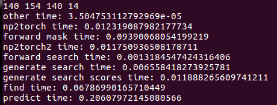
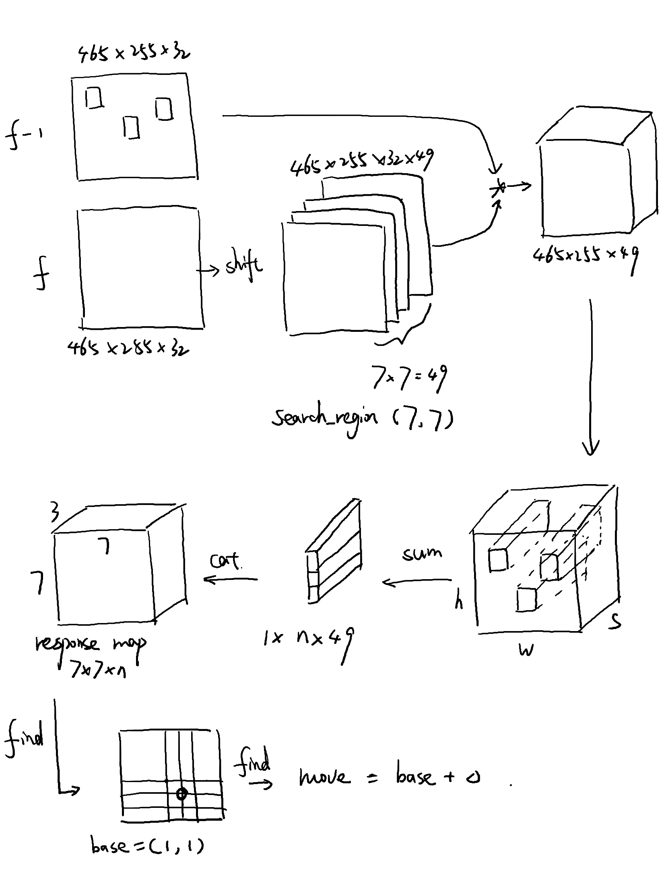
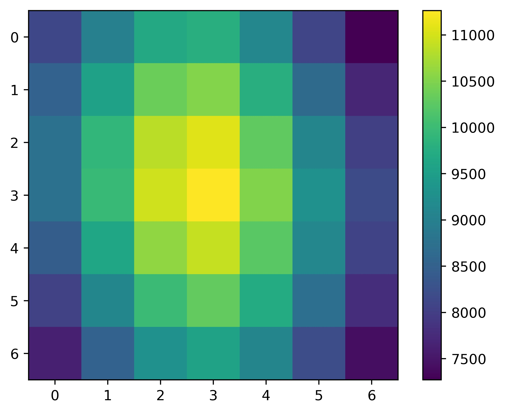
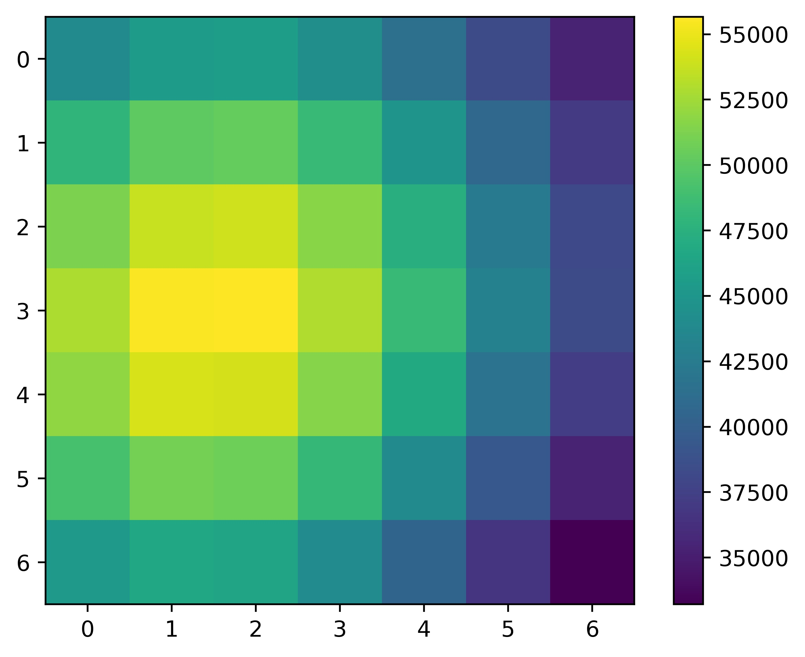

# MOT实验

## 1 SiamMOT

对Siam部分进行了提速处理与精度提升。

把耗时的语句进行了速度优化，数据通路也作了重新调整，主要目标是优化SiamMOT的核心组件的速度，MOTDT 框架内其他部分暂时不做优化。

以上是SiamMOT核心组件中各部分运行时间的截图，挑选的是MOT19中基本上最拥挤的场景之一，检测到的目标有154个。可以看到最花时间的两个部分是添加mask（forward mask time）与寻找响应最大的位置（find time）。

纯运行网络所占时间只是0.001s这个量级.

1.加mask时，现在使用的是加高斯窗，需要用到指数运算，上次与时老板讨论获得了一些启发，可以改成线性窗/余弦窗等运算量更小的操作。但需要进一步实验，来取得一个速度与精度的tradeoff。

2.最后是寻找响应最大的位置，这是我认为目前整个系统中最需要关注的部分，这部分目前占用了大部分时间，而且其输出与跟踪的精度息息相关，有很大的优化余地。

3.还有一点疑惑是np2torch time,即把img从numpy转化成torchtensor的耗时,居然会达到0.01s之多,解决掉上面两个部分后,这部分会成为新的速度瓶颈.

#### 1.1 论文整体思路图

#### 1.2 delta介绍

如图一所示，响应最高点为（3,3）位置，即判断目标不动。但实际人眼观察可以发现左侧响应更高，这在实验中可以观察到的效果就是，当目标发生细微运动时，框还会保持在原地，累计误差会导致框逐渐偏离真正的目标。所以要在选找响应最高的位置同时加入delta修正机制。

由于SiamMOT里是相邻两帧对比计算位置，而传统Siam网络始终与第一帧的模板做比对，所以不会存在这个问题。

#### 1.3 目前想到的针对累计误差的修正办法

1.对响应图做累加操作，统计历史响应图。

2.使用detector进行修正，见第二部分CenterNet.

## 2 CenterNet

使用CenterNet在MOT19上重新进行训练，以下为测试集上的响应图效果。

下一步会把这个响应图的结果融合进SiamMOT中，可以提升SiamMOT的跟踪精度。之后还可以利用这个响应图处理目标消失与目标产生问题，就可以抛开MOTDT，形成一个新的更简洁高效的框架了。

