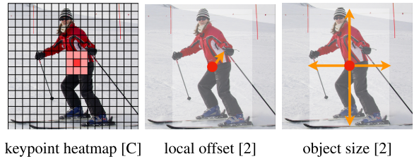

# Objects as Points

这次仔细读这篇文章，除了学习作者论文的写法，还有一点重要的目的，是为了学习网络训练的一些细节，比如label设计/loss设计/网络结构设计等等。因为最近把SiamMOT改成end2end，遇到了一些迷惑的地方，希望能从这篇论文中获得启发。

## Loss

They use the **focal loss** to train such a network, and the training procedure is follow CornerNet (Law and Deng).

The loss contains three parts: keypoint Loss (Lk)、size Loss (Lsize) and offset Loss (Loff). The offset loss is designed to handle the decretization error caused by the output stride.

## Label

The label designing in this paper is quite similar to the mask process in SiamMOT. They splat all ground truth keypoints onto a heatmap Y using a Gaussian kernel Yxyc = exp(...). If two Gaussians of the same class overlap, they take the element-wise maximum.

## Network

The network predict a total of C+4 outputs at each location. All output share a common fully-convolutional backbone network.

## Training

They train the network on an input resolution of 512\*512. This yields an output resolution of 128\*128.

The batch size is 128 (on 8GPUs) and the learning rate is set to 5e-4.They train for 140 epochs, with learning rate droped 10\* at 90 and 120 epochs. 

## Inference

They use three levels of test augmentations: no augmentation, flip augmentation, and flip and multi-scale (0.5, 0.75, 1, 1.25, 1.5). For multi-scale, they use NMS to merge results.

Training and testing in a lower resolution (384 × 384) runs 1.7 times faster but drops 3AP.

# Tracking without bells and whistles

这一篇是将检测和跟踪做成了一个统一的框架，和我之前的思路比较像，值得一读。

They exploit the bounding box regression of an object detector to predict an object's new position in the next frame, thereby converting a detector into a Tracktor. Moreover, they use a Siamese network as a re-identification part.

The author raises a question: **If a detector can solve most of the tracking problems, what are the real sit- uations where a dedicated tracking algorithm is necessary?**

## The tracking procedure

The tracking procedure is demostrated as  following. First, the regression of the object detector regresses bounding boxes bkt-1of frame t−1 to the object’s new position at frame t. The corresponding object classification scores Skt of the new bounding box positions are then used to kill potentially occluded tracks. Second, the object detector provides the set of detections Dt of frame t. Finally, new tracks are initialized if a detection has no Intersection over Union larger than a certain threshold.

**The overall procedure is similar to SiamMOT, the main difference is that they use object regressor while we use the SiamMOT network.**

## Termination and initialization

There are two cases for killing a trajectory: low classification scores or NMS.

They consider a detection as a potentially new object only if it is covering a part of the image that is not explained by any trajectory. Comparing the IoU distance between the detection and existing targets.

## Tracking extensions

They use two simple extensions to enhance their tracking method: **a motion model** and **a re-identification algorithm**.

For sequences with a moving camera, they apply a simple camera motion com- pensation (CMC) by aligning frames via image registration using Enhanced Correlation Coefficient (ECC) maximiza- tion.

## Released Code

The code of Tracktor is opensourced at https://github.com/phil-bergmann/tracking_wo_bnw. I will run it later in this week.

# Excerpt

the output stride 4

We use the default output stride R=4 in literature[]. The output stride downsamples the output prediction by a factor R.

We use several different fully-convolutional encoder-decoder networks to predict Y from an image I:...

discretization 离散化

Most state-of-the-art works follow the tracking-by-detection paradigm which heavily relies on the performance of the underlying detection method.

In our case, it evaluates the likelihood of the proposal showing a pedestrian.

Such a trajectory is defined as a list of ordered object bounding boxes Tk = {bkt1 , bkt2 , · · · }, where a bounding box is defined by
its coordinates bkt = (x, y, w, h), and t represents a frame
of the video. Note, that each Tk or Bt can contain less elements than the total number of frames or trajectories in a sequence, respectively.

**Our assumption is that the target has moved only slightly from one frame to the next, which is usually verified from high frame rates, therefore, the bounding box regressor of the detector is able to snap to the slightly shifted object position.**

**The identity is automat- ically transferred from the previous to the newly regressed bounding box, effectively creating a trajectory.**

