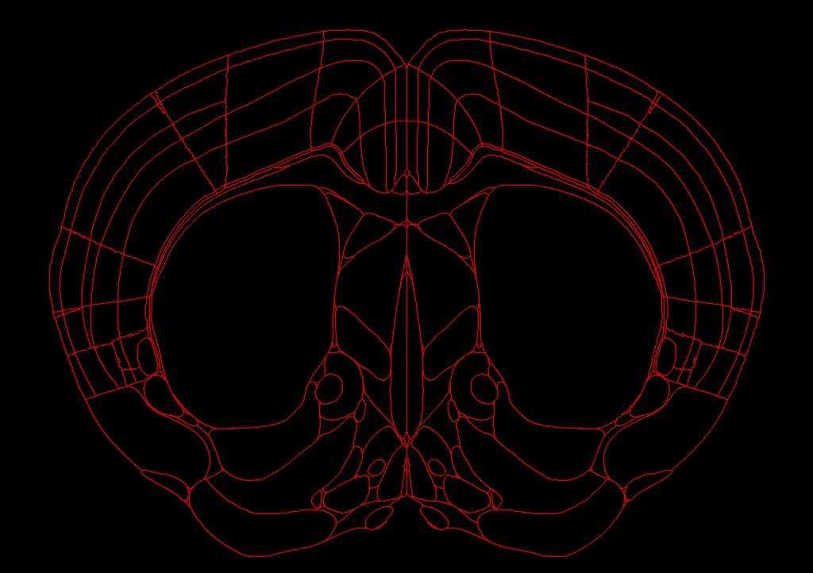
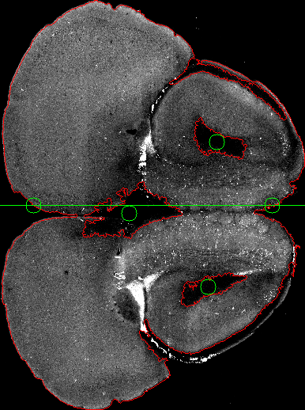
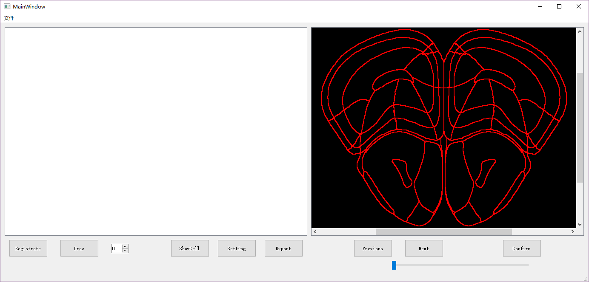
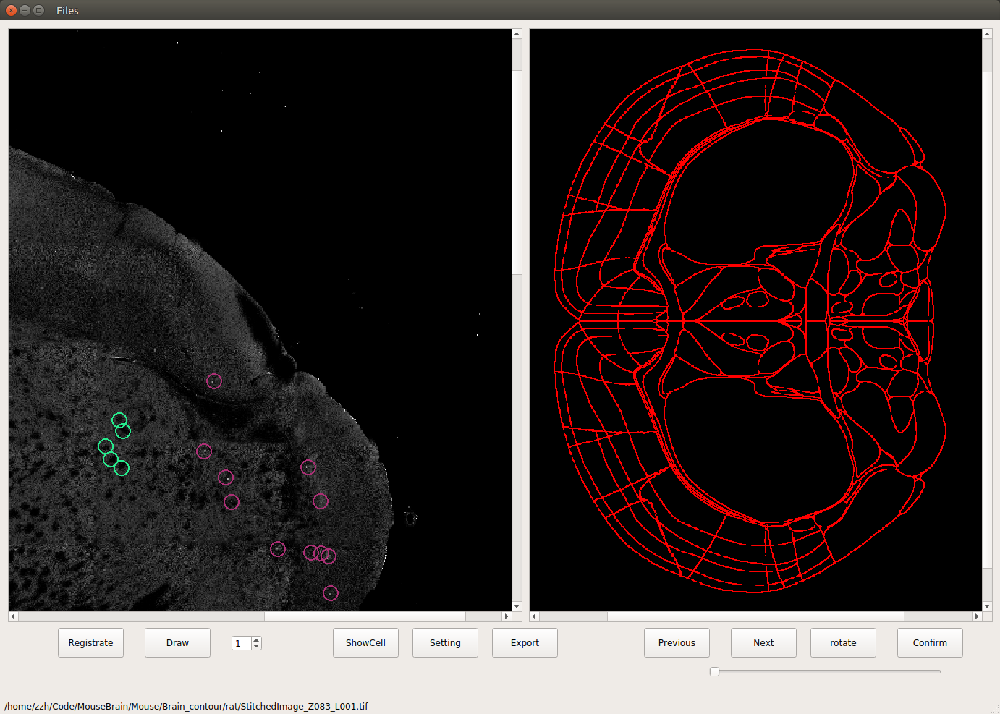

# 2018.10.24

何苗老师提了三个层次的需求。

1. 标准脑切片模板和鼠脑切片图片人工一一对应标准脑切片模板和鼠脑切片图片人工一一对应。
2. 点击分区，自动识别出胞体数量。
3. 将2D自动识别好的鼠脑切片图片重构成3D立体模型。

# 2018.10.24 - 2018.11.21

### 1.自动微调算法

自动微调算法效果如下图。左边为微调前，右边为微调后。我们设计了基于内部特征轮廓的算法来提取特征点。对于这幅图，使用的是如下图位置的6个绿点，这6个特征点是人为设计的，其坐标采用轮廓算法进行自动提取。针对不同位置的图谱，需要选取其他特征点。

### 2.爬取allen图谱

alanbrain网站上提供了图谱的下载链接，但只是提供了jpg图片的下载，没有提供关于分区的具体数据。

但可以从网站源码中使用爬虫获取我们需要的分区数据。下图为alan-brain atlas中的精确分区信息。atlas中每张图谱大小均为11400×8000，structure为脑区索引，因为一个脑区会分为多个轮廓绘制，所以一个structure会对应多个contour，contour中存储的就是该脑区的轮廓。

# 2018.11.21 - 2018.12.19

在不同图谱位置测试变形算法与特征点自动寻找算法。

# 2018.12.19 - 2018.1.9

开始探索软件界面编写。

### WholeBrain工具初探

> wholebrain software软件包使用教程：http://www.wholebrainsoftware.org/cms/tutorials/   
>
> https://github.com/tractatus/wholebrain

WholeBrain Software提供了一整套软件包，可以实现从图像拼接、图像配准、胞体识别再到三维重建的一系列步骤。这篇论文介了绍这一套工具的功能以及一些基本的原理，未涉及太深的细节。不过在github上开放了源码，可以研究源码。

我们仔细研究了一下作者提供的这一套工具。总的来说，感觉是把我们之前设想的功能都实现了，而且思路也基本一致。通过提取特征点进行图像配准和自动分区，然后手动设置一些参数进行胞体识别，最后统计各个脑区的胞体数目。论文中还提到了三维重建的一些内容，不过在软件包的使用教程中并没有提及，不知是不是因为暂未开源。

# 2018.1.9 - 2018.3.20

完成了特征点寻找算法和匹配算法后，何苗老师提供了他们的照片。我们之前研究的特征点寻找和轮廓匹配算法基本失效，开始新的算法探索。

发现开源项目不好用，不适合何苗老师提供的图谱。

之后进行UI界面开发。首先采用了何苗老师说的imagej方案，但不支持python，只有java接口，无法进行算法移植。

# 2019.3.20 - 2019.4.16

学习界面的编写。

尝试了awt等一些其他库，发现不太好用，选择使用pyQt5进行界面开发。

我改用pyQT进行界面编写。

同时陈佳禹进行算法的继续研究。

界面雏形，左侧显示鼠脑切片图，右侧显示图谱。

左侧下方有两个按钮，一个是配准按钮，一个是画点按钮，目前还未编写相应功能。

右侧下方三个按钮分别是，向前翻页，向后翻页，确认按钮。

菜单栏里目前只有“文件”，在这里可以选择需要打开的鼠脑图片。

存在的问题：

​	1.tiff格式图片读取显示出错

​	2.还未实现图片缩放功能

后续计划：

​	1.修好bug，使tif图片能正常显示

​	2.加入滚轮缩放鼠脑图片的功能

​	3.尝试实现打点标注功能，并将标注输出为文件

# 2019.4.16 - 2019.5.15

#### 主要完成的功能

1.输入换算比例功能，输入像素=X微米。

2.输入Z轴脑片厚度。

3.修改零点。

4.加入Z轴信息，如脑片编号。

5.追踪功能调研，寻找连接一系列点的算法。

6.优化图片和图谱显示。

# 

### 2. 效果演示

主界面如下图所示，增加Setting按钮和ShowCells按钮，点击进入设置界面和细胞显示界面。

追踪算法经过一番调研，决定借鉴多目标跟踪中的数据关联算法。多目标跟踪中常用匈牙利算法和KM算法进行数据关联，使用该算法进行细胞追踪预计可以实现比较好的效果。

具体而言，将相邻两脑片中的细胞作为顶点，相邻两脑片中两细胞的欧氏距离作为边权重，构建二分图，之后使用匈牙利算法和KM算法，求解全局最大匹配。

# 2019.5.15 - 2019.7.7

关键点寻找算法未成功，改为手动打点匹配，界面各项功能基本实现，包括图片的基本操作/配准/打点/输出打点文件。

# 2019.7.7至今

1.三维显示及扭曲切片。

2.根据何苗老师所提需求继续优化。

# 目前任务

1.结项需要，与任务书功能进行对比。

2.优化界面，进一步满足何苗老师使用需求。

3.写报告。

# 附
### 实际上的操作流程：

1。图谱的某个切面与切片配准

2。在切片上点点，映射到图谱上

3。统计输出结果,三维可视化等各项功能。

### 细节的要求

一、对于现有软件的优化：

（1）打点的性状选择

（2）背景网格线协助鼠标选点

（3）图像显示（多通道的显示、图像显示的色阶调整）

（4）打点数据存储的文件命名

（5）多张图像载入和前后翻页

（6）含有脑区信息的数据输出

（7）脑片不对称情况下，对半张图谱的对准

二、乳头体区域的标准图谱（3维）

（1）对数据的要求：Neurolucida软件描绘的轮廓以何种方式输出？能否满足要求？

（2）三维图谱构建后，能否允许多个切面角度？

（3）真实数据与图谱的配准（利用现有软件，把allen图谱换成自制图谱   

三、三维追踪
（1）对于轴突束的追踪：

a.允许在单张图上绘制轴突束的外轮廓，与前后图上的外轮廓平滑连接，得到有体积的轴突束

b.在单张图上打点，与前后图上的点连接，得到路径（类似现有的功能，但不需要计算最近的点，只需要把同组的点相连接）

（2）单细胞、单根纤维的追踪：允许在单张图上画线，与前后图上的线相连（起点、终点、分叉？）
