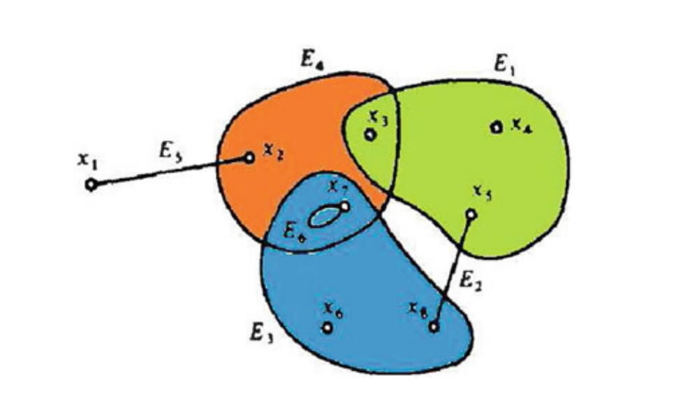
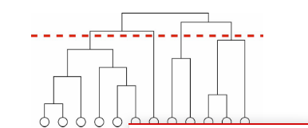
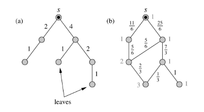

# community detection

## three representation of network

### Unipartite and Bipartite Graphs

A graph is a representation of a set of objects called vertices, some of which are connected by links. Object connections are depicted by links, also called edges. Such a mathematical structure may be referred to as a unipartite graph

### Hypergraph

A hypergraph H is apair(V, E) whereV D v1, v2, ..., vn is a nonempty (usually limited) set and E D E1, E2, ..., Em is a family of not empty subsets of V. The elements of V are the vertices of H. The elements of E are the edges (also called hyperedges) of H

### Galois Lattice

Freeman was the first to use Galois lattices in order to represent network data. The underlying assumption is that individuals sharing the same subset of properties define a community. The approach adopted consists of the following: objects, attributes, and the set of relations between objects and attributes form a “context” .

This set of relations can then be represented by a binary bi-adjacency matrix, whereby objects o are the columns, attributes a are the rows, and a “1” is placed at the cell corresponding to a pair (oi ,aj)  if oi possesses aj . A maximum subset of objects that contain a subset of attributes is defined as a “concept” ,that is, a group of objects for which the addition or removal of an attribute changes its constitution. All objects of a concept then form the “extent,” and all attributes of a concept give rise to the “intent”. According to the definition of Galois hierarchies, an object can appear in all the concepts where it can share the same set of attributes with other objects belonging to other concepts.

## Grivan-Newman angorithm

## hierarchical clustering

They fall into two broad classes, agglomerative and divisive , depending on whether they focus on the addition or removal of edges to or from the network.

ours differ in focusing not on removing the edges between vertex pairs with the lowest similarity, but on finding edges with the highest ‘‘between- ness,’’ where betweenness is some measure that favors edges that lie between communities and disfavors those that lie inside communities.

## the general form of our community structure findingalgorithm is as follows

1.Calculate betweenness scores for all edges in the network

2.Find the edge with the highest score and remove itfrom the network. (If two or more edges tie for highest score, choose one of them at random and remove that.)

3.Recalculate betweenness for all remaining edges

4.Repeat from step2

### Shortest-path betweenness

1.We find first the ‘‘leaves’’ of the tree, i.e., those nodes such that no shortest paths to other nodes pass through them, and we assign a score of 1 to the single edge that connects each to the rest of the tree, as shown in the figure. Then, starting with those edges that are farthest from the source vertex on the tree,, we work upwards, assigning a score to each edge that is 1 plus the sum of the scores on the neighboring edges immediately below it (i.e., those edges with which it shares a common vertex). When we have gone though all edges in the tree, the resulting scores are the betweenness counts for the paths from vertex s. Repeating the process for all possible vertices s and summing the scores, we arrive at the full betweenness scores for shortest paths between all pairs. 

2.1 the weight on a vertex i represents the numberof distinct paths from the source vertex to i.

1.The initial vertex s is given distance ds=0 and weightws=1

2.Every vertex i adjacent to s is given distance di=ds+1=1 and weight wi=ws=1.

3.For each vertex j adjacent to one of those vertices i, we do one of three things: 

  (a） If j has not yet been assigned a distance, it is assigned distance dj=di+1 and weight wj =wi 

（b）if j has already been assigned a distance and dj =di+1, then the vertex’s weight is increased by wi , that is,wj←wj+wi ; 

（c） if j has already been assigned a distance and dj<di+1, we do nothing

4.Repeat from step 3 until no vertices remain that have assigned distances but whose neighbors do not have assigned distances.

2.2

1. Find every ‘‘leaf’’ vertex t, i.e., a vertex such that no
   paths from s to other vertices go though t. 
2. For each vertex i neighboring t, assign a score to the
   edge from t to i of wi /wt . 
3. Now, starting with the edges that are farthest from the source vertex s. To the edge from vertex i to vertex j, with j being farther from s than i, assign a score that is 1 plus the sum of the scores on the neighboring edges imme- diately below it (i.e., those with which it shares a common vertex, all multiplied by wi /wj )
4. Repeat from step 3 until vertex s is reached.

# community evaluation

## modularity

$$Q=\sum_{i}{(e_{ii}-a_i)^2}=T_re-{||e^2||}$

Let us define a k*k symmetric matrix e whose element eij is the fraction of all edges in the network that link verti- ces in community i to vertices in community j

define the row or column sums ai

